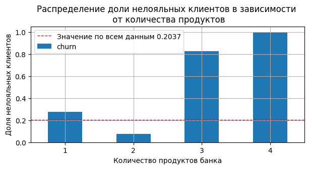
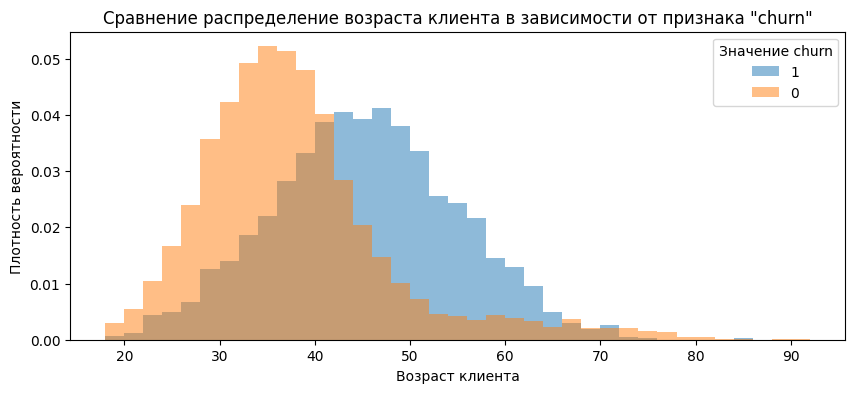
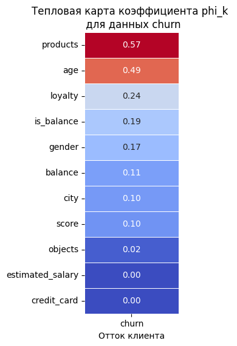

# Отток клиентов банка «Метанпром»: портрет уходящего клиента

**Задача.** По данным 10 000 клиентов регионального банка найти признаки, связанные с уходом клиента, и описать сегменты с повышенным риском оттока.

**Данные.** Две таблицы, связанные по `userid`: использование услуг банка (скоринг, баланс, продукты, кредитка, активность, доход, отток) и персональные данные (возраст, пол, город).

**Стек.** Python: pandas, matplotlib, seaborn, phik.

## Что сделано

- **Предобработка:** snake_case для столбцов, понижение разрядности типов, проверка дубликатов и заглушек.
- **Пропуски в балансе (36%):** проверил гипотезы о природе пропусков — они связаны с количеством продуктов клиента, а не с уходом. Оставил их и вынес факт наличия баланса в отдельный признак.
- **EDA:** распределения всех признаков, выбросы, аномальный пик скоринга на 850.
- **Связь с оттоком:** корреляция `phi_k` для разнотипных признаков + сравнение доли оттока по сегментам, нормированные гистограммы и KDE.

## Ключевые результаты

Общий отток — **~20%**. Сильнее всего с ним связаны:

| Фактор | Группа риска | Отток | Для сравнения |
|---|---|---|---|
| Продукты | 1 продукт | ~27% | ~8% при 2 продуктах |
| Продукты | 3–4 продукта | ~83–100% | небольшая группа — 326 клиентов |
| Возраст | 40–50 лет | медиана 45 лет | 36 лет у оставшихся |
| Город | Ростов Великий | ~32% | ~16% в других городах |
| Активность | неактивные | ~27% | ~14% у активных |
| Пол | женщины | ~25% | ~16% у мужчин |

Баланс, доход, скоринг и кредитная карта на отток почти не влияют.

Два продукта — «золотая середина»: отток ~8%. С одним продуктом клиенты уходят в ~3 раза чаще, а с тремя-четырьмя — почти все.

Возраст ушедших клиентов смещён вправо: медиана 45 лет против 36 у оставшихся.

Сильнее всего с оттоком связаны количество продуктов (phi_k ≈ 0,57), возраст (≈ 0,49) и активность клиента (≈ 0,24).

**Портрет уходящего клиента:** 40–50 лет, один продукт банка, неактивен, чаще из Ростова Великого.

## Рекомендации

1. Кросс-продажа **второго** продукта клиентам с одним продуктом — при двух продуктах отток ниже в ~3 раза. Но не больше: у клиентов с 3–4 продуктами отток 83–100%, эту группу нужно разобрать отдельно.
2. Удерживающие предложения для клиентов 40–50 лет.
3. Разобраться с причинами двойного оттока в Ростове Великом.
4. Реактивация неактивных клиентов через программу лояльности.

## Файлы

- [`Отток клиентов банка.ipynb`](Отток%20клиентов%20банка.ipynb) — ноутбук с кодом, графиками и выводами.
- `images/` — ключевые графики.

## Ограничения

- Группа клиентов с 3–4 продуктами небольшая (326 клиентов), выводы по ней ненадёжны.
- Метод `phi_k` показывает силу связи, но не направление и не причинность: направление определялось по сегментам.
- Данные загружаются по ссылке прямо в ноутбуке (`https://code.s3.yandex.net/datasets/`), в папку они не включены.
