# Исследование стартапов: как развивалось венчурное финансирование (Python)

Учебный проект аналитика данных. Финансовая компания, работающая с венчурными инвестициями, хочет понять закономерности финансирования стартапов и оценить перспективы выхода на рынок с покупкой и развитием компаний. Нужно провести исследование на исторических данных и дать рекомендацию, **куда и как стоило бы инвестировать, если бы на дворе был 2015 год**.

**Инструменты:** Python, pandas, matplotlib, seaborn, Jupyter Notebook.

**Ноутбук:** [`Исследование стартапов.ipynb`](%D0%98%D1%81%D1%81%D0%BB%D0%B5%D0%B4%D0%BE%D0%B2%D0%B0%D0%BD%D0%B8%D0%B5%20%D1%81%D1%82%D0%B0%D1%80%D1%82%D0%B0%D0%BF%D0%BE%D0%B2.ipynb) (весь код, графики и выводы внутри)

---

## Данные

Два учебных датасета (данные лежат в папке `data/`; исходный архив с инвестициями также доступен по [ссылке](https://code.s3.yandex.net/datasets/cb_investments.zip)).

| Датасет | Что содержит |
|---|---|
| `cb_investments` | 54 294 компании: рынок, статус, страна, даты основания и раундов, число раундов, суммы финансирования по типам (seed, venture, angel, debt и другие) и по раундам A–H |
| `cb_returns` | Объёмы возвратов средств по годам (2000–2014) и типам финансирования, в млн долларов |

## Что сделано

1. **Предобработка.** Привёл суммы в `funding_total_usd` к числам (убрал разделители разрядов), даты к типу datetime, заполнил пропуски в текстовых столбцах заглушками, удалил дубликаты и компании без данных о финансировании, заполнил пропущенные `mid_funding_at` серединой между первым и последним раундом. Осталось **40 907 из 54 294 компаний (75,3%)**, то есть отброшено 24,7% данных.
2. **Группы по срокам финансирования:** единичное финансирование, срок до года, срок более года.
3. **Сегменты рынка:** массовые (больше 120 компаний), средние (35–120) и нишевые (меньше 35); средние и нишевые сегменты объединены в `mid` и `niche`.
4. **Выбросы:** аномальный объём финансирования найден методом IQR отдельно по каждому сегменту и исключен; оставлены годы, в которых было не менее 50 раундов.
5. **Типы финансирования:** объёмы, популярность и возвраты.
6. **Динамика:** размер раунда и число раундов по годам, рост массовых сегментов, доля возврата по типам финансирования.

---

## Результаты

### Группы по срокам финансирования

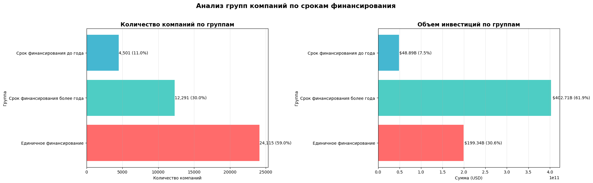

Большинство компаний (**59%**) привлекли деньги один раз, но основной объём достался долгосрочным: компании со сроком финансирования более года (30% компаний) получили **61,9%** всех инвестиций, а единичное финансирование — только 30,6%. Группа «до года» самая маленькая: 11% компаний и 7,5% инвестиций.

### Сегменты рынка

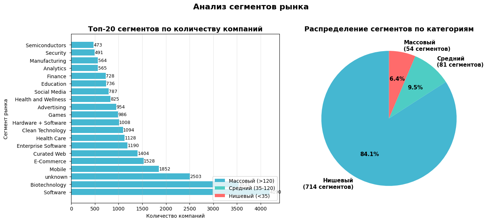

В данных **849 сегментов**: 54 массовых (в них 33 344 компании, 81,5%), 81 средний (5 069 компаний) и 714 нишевых (2 494 компании). Самые крупные — Software (4 190 компаний), Biotechnology (3 531) и Mobile (1 852).

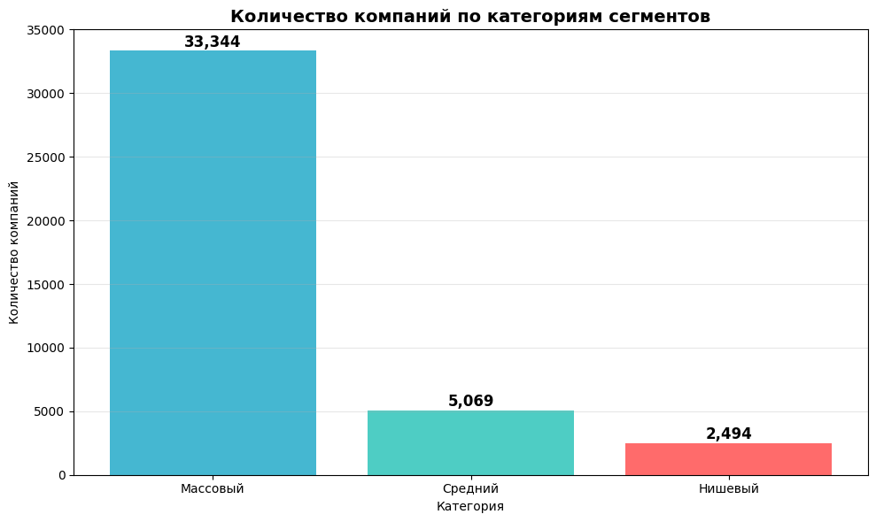

### Типичное финансирование и выбросы

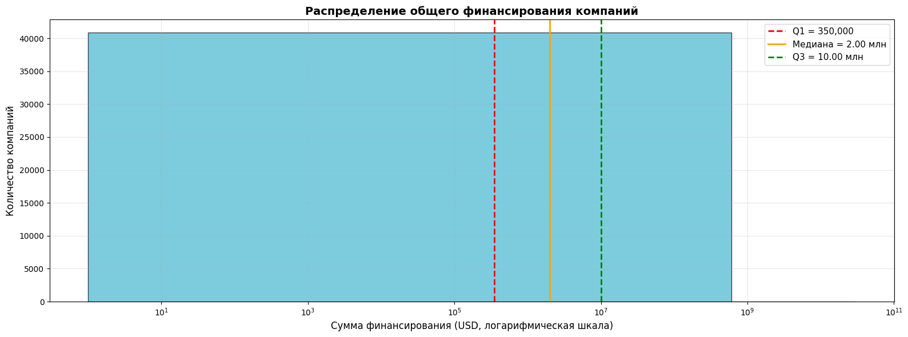

Медианное общее финансирование компании — **2 млн долларов**, типичный интервал (от 25% до 75% квантиля) — **от 350 тыс. до 10 млн**. Среднее (15,9 млн) сильно выше медианы из-за крупных сделок, максимум достигает 30 млрд.

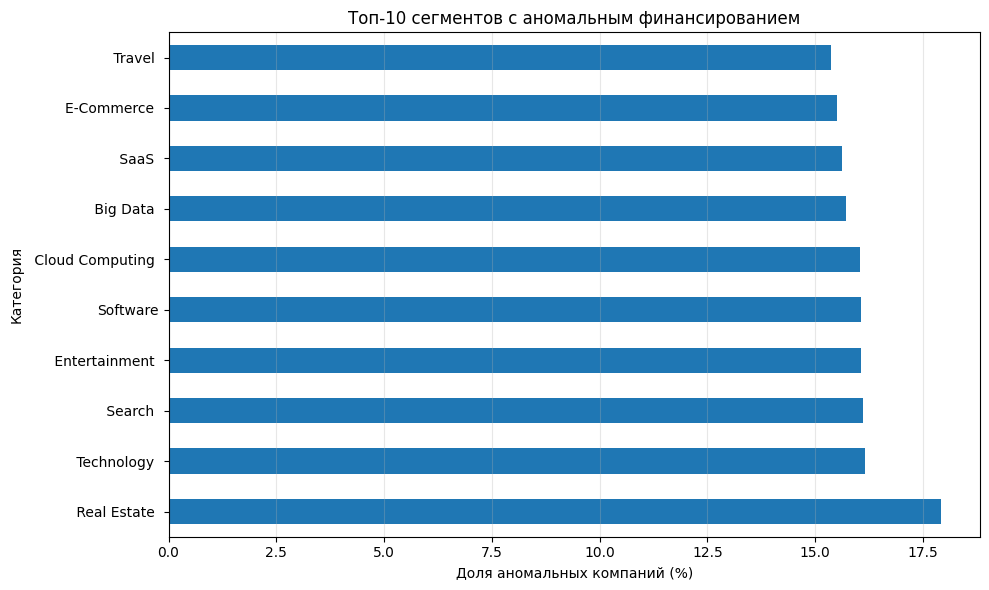

Аномально высокое финансирование получили 5 202 компании (12,7%), их исключили. Наибольшая доля таких компаний в сегментах Real Estate (17,9%), Technology (16,2%), Search и Entertainment (по 16,1%). После фильтрации по годам с не менее чем 50 раундами осталась **35 629 компаний**, получавших финансирование в 2000–2014 годах.

### Типы финансирования

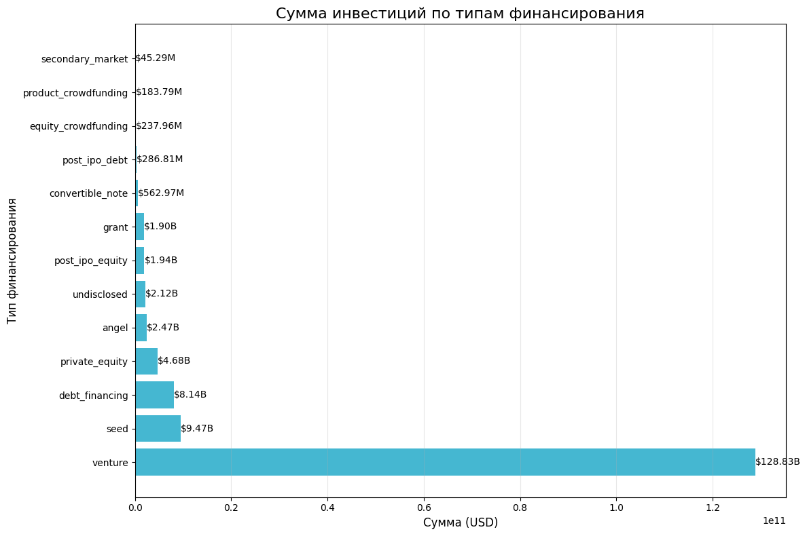

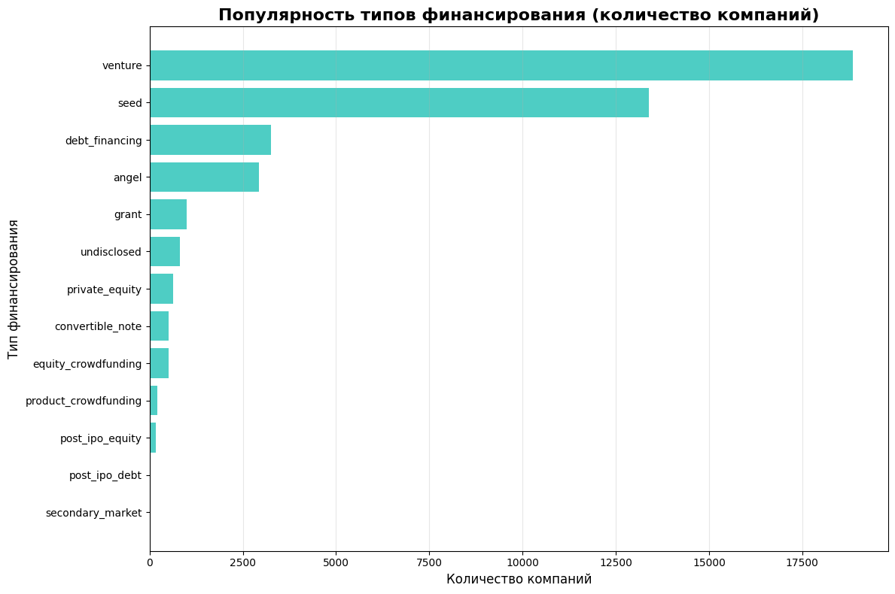

**Venture** — лидер и по объёму (**128,8 млрд долларов**), и по популярности (18 861 компания). На втором месте по популярности `seed` (13 391 компания), но объём заметно меньше (9,5 млрд), значит сделки мелкие. Третий по объёму — `debt_financing` (8,1 млрд, 3 261 компания). Редко используются вторичный рынок, краудфандинг и пост-IPO инструменты, и объёмы у них небольшие. Популярный, но небольшой по объёму тип — гранты (1 001 компания, 1,9 млрд).

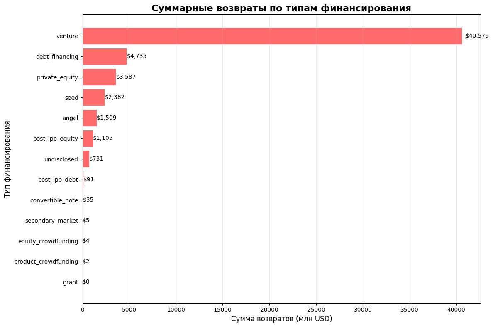

Больше всего средств возвращается по `venture` (40,6 млрд), затем по `debt_financing` (4,7 млрд) и `private_equity` (3,6 млрд).

### Динамика по годам

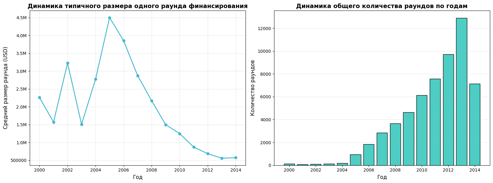

Типичный размер раунда (медиана) был максимальным в **2005 году — 4,5 млн долларов**, а к 2014 году снизился до **0,57 млн**. При этом число раундов росло до 2013 года (12 907), в 2014 году их 7 146. Рынок «дробился»: инвесторы стали чаще вкладывать небольшие суммы.

### Рост массовых сегментов

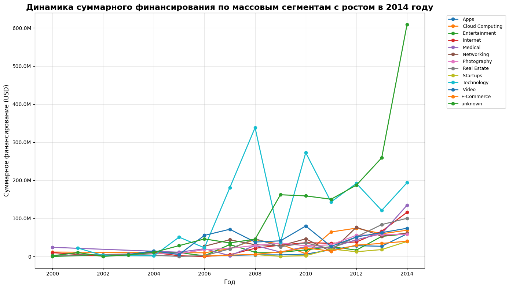

Из массовых сегментов финансирование в 2014 году по сравнению с 2013 выросло у 13 сегментов. Самый быстрый и уверенный рост показывают **Medical** (с 22,7 до 134,5 млн долларов за 2011–2014 годы) и **Internet** (с 34,6 до 116,0 млн), затем идут Real Estate (с 20,0 до 100,1 млн), Video и E-Commerce. Отдельная строка `unknown` — это компании без указанного рынка, а не отрасль.

### Доля возврата средств

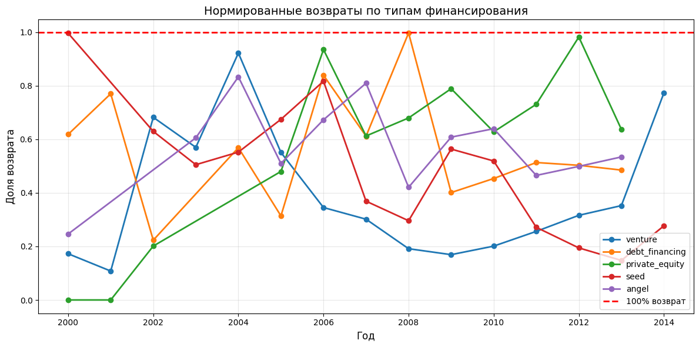

| Тип | Инвестиции | Возвраты | Средняя доля возврата |
|---|---|---|---|
| angel | 2,47 млрд | 1,51 млрд | 57,0% |
| debt_financing | 8,14 млрд | 4,73 млрд | 56,2% |
| private_equity | 4,68 млрд | 3,59 млрд | 55,6% |
| seed | 9,47 млрд | 2,38 млрд | 48,7% |
| venture | 128,83 млрд | 40,58 млрд | 39,4% |

Доля возврата у `venture` ниже, но она **устойчиво росла с 2009 года** (17% → 20% → 26% → 32% → 35% в 2013 году). У `debt_financing` показатель держится около 40–50% без роста, у `angel` — 47–64%, у `private_equity` он высокий, но скачет по годам, а у `seed` снижается (с 52% в 2010 году до 15% в 2013 году). Краудфандинг, гранты и конвертируемые займы возвращают почти ничего.

---

## Выводы и рекомендации (на 2015 год)

1. **Отрасль.** Стоит инвестировать в массовые сегменты **Medical** и **Internet**: они показывают самый устойчивый рост финансирования до 2014 года и достаточно велики. Дополнительно можно рассмотреть Real Estate и E-Commerce.
2. **Тип финансирования.** Наиболее уместно **venture**: он доминирует по объёму и популярности, даёт самый большой абсолютный возврат, а его доля возврата растёт. Консервативная альтернатива — `debt_financing` (доля возврата около 56%, но менее подходит для ранних стадий роста).
3. **Стратегия.** Рынок становится более «дробным»: раундов больше, а размер каждого меньше, поэтому имеет смысл планировать участие в нескольких раундах одной компании, а не вкладывать всё сразу.
4. **Чего избегать.** Краудфандинг и гранты не дают возвратов и не подходят для получения прибыли.

## Ограничения

- Названия рынков в исходных данных содержат лишние пробелы и разные написания (например, `Software` встречается в нескольких вариантах), поэтому часть сегментов считается отдельно друг от друга. Компании без указанного рынка (`unknown`) входят в массовые сегменты как один сегмент.
- По 2014 году есть записи за все месяцы, но декабрь почти пуст (23 компании), поэтому показатели за 2014 год, включая высокую долю возврата у `venture`, стоит трактовать осторожно.
- Доля возврата считается как отношение возвратов из отдельной таблицы к инвестициям только тех компаний, которые остались в выборке после очистки, поэтому это оценка, а не точный показатель окупаемости.
- Данные исторические (до 2014 года), поэтому выводы описывают тогдашний рынок.

## Структура репозитория

```
├── README.md
├── Исследование стартапов.ipynb   # анализ, графики и выводы
└── images/                        # графики для README
```
