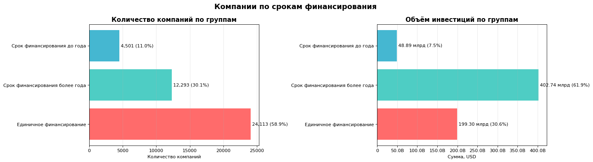
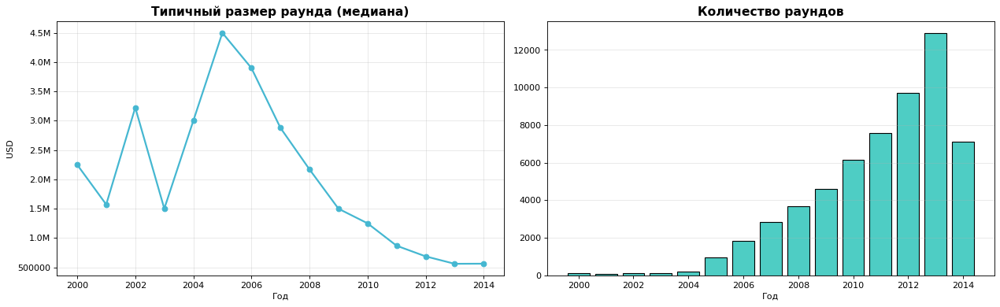
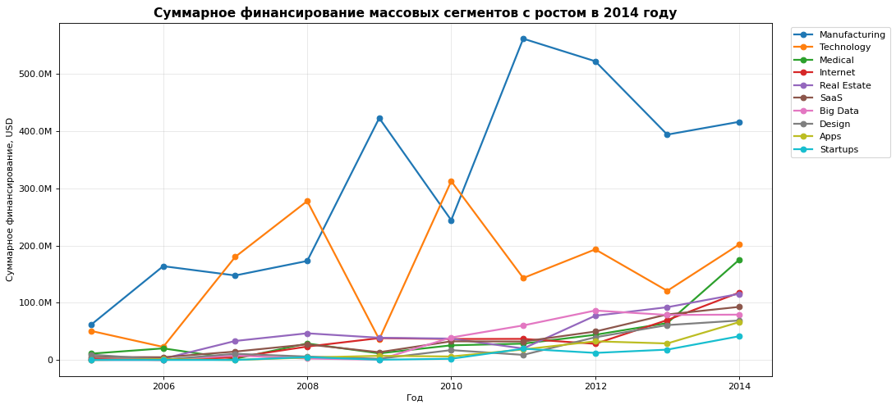

# Рынок стартапов: куда инвестировать в 2015 году

**Задача.** Венчурный фонд выбирает направления и инструменты для инвестиций. По данным о ~54 тыс. компаний нужно изучить структуру и динамику финансирования стартапов за 2000–2014 годы и дать рекомендации: в какие сегменты рынка и через какие типы финансирования вкладываться.

**Данные.** `cb_investments` — компании, сегменты рынка, даты и суммы раундов по 13 типам финансирования; `cb_returns` — возвраты инвесторам по годам и типам финансирования. Оба файла лежат в [`data/`](data).

**Стек.** Python: pandas, numpy, matplotlib.

## Что сделано

- **Предобработка.** Нашёл, что из-за пробелов в значениях `market` один сегмент записывался по-разному, и число сегментов было завышено с 439 до 939. Перевёл суммы и даты в правильные типы, восстановил пропуски в дате «среднего» раунда.
- **Инжиниринг признаков.** Разделил компании по сроку финансирования (один раунд / до года / больше года), а сегменты рынка — на массовые, средние и нишевые.
- **Выбросы.** Нашёл аномально крупное финансирование по правилу 1,5 IQR отдельно в каждом сегменте и исключил такие компании (12,8%).
- **Анализ.** Сравнил типы финансирования по объёму, популярности и возвратам, изучил динамику размера раундов, нашёл массовые сегменты с ростом в 2014 году, посчитал годовую долю возврата по типам финансирования.

## Ключевые результаты

| Вывод | Цифры |
|---|---|
| Деньги идут в компании с долгой историей финансирования | 30% компаний получили 62% инвестиций |
| Рынок сконцентрирован | 49 массовых сегментов (12%) — 89% компаний |
| Типичное финансирование компании | 350 тыс. – 10 млн USD, медиана 2 млн |
| Раунды дробятся | типичный раунд: 4,5 млн (2005) → ~0,56 млн (2014) |
| Venture доминирует, но возвращает меньшую долю | ≈ 80% денег рынка, доля возврата ≈ 39% |
| Лучшая доля возврата | private equity ≈ 66%, angel 57%, debt financing 54% |
| Самый быстрый рост в 2014 году | Medical +172%, Internet +69% |

## Графики

**Деньги идут в компании с долгой историей финансирования**

**Рынок дробится: раундов всё больше, а каждый всё меньше**

**Массовые сегменты с ростом финансирования в 2014 году** — самый устойчивый рост у Medical и Internet

## Рекомендации

1. **Сегменты:** Medical и Internet — самый сильный и при этом устойчивый рост финансирования среди массовых сегментов. Более рискованное дополнение — Apps (+129%).
2. **Инструмент:** основная часть — venture с поэтапным входом (малые раунды и докладка в компании, которые проходят следующие раунды) и широкой диверсификацией. Защитная часть — debt financing и private equity.
3. **Не подходят для заработка:** краудфандинг, конвертируемые займы и гранты — возврат меньше 10%.

## Файлы

- [`startup_investments_eda.ipynb`](startup_investments_eda.ipynb) — ноутбук с кодом, графиками и выводами.
- [`data/`](data) — исходные данные.
- [`images/`](images) — графики для README.
