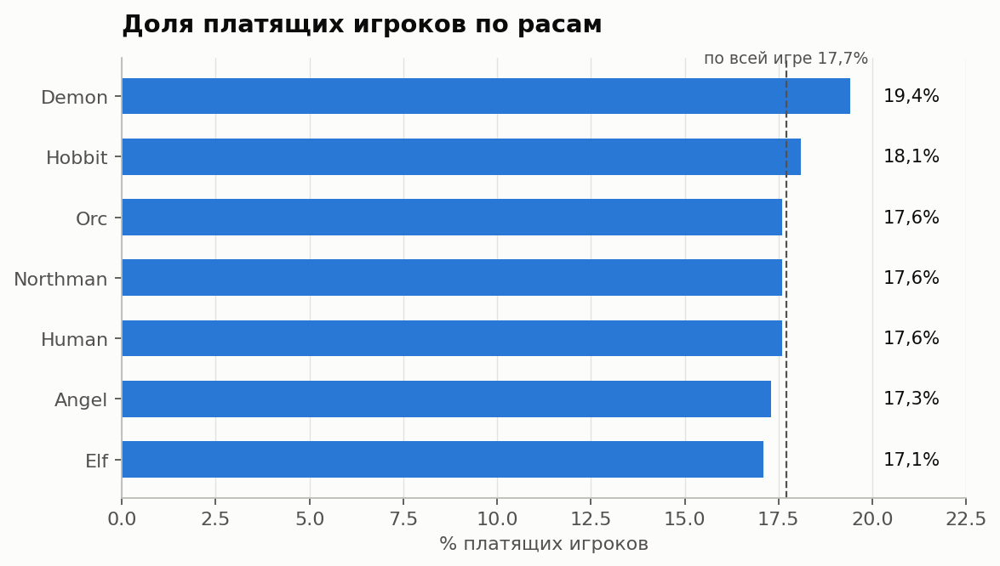
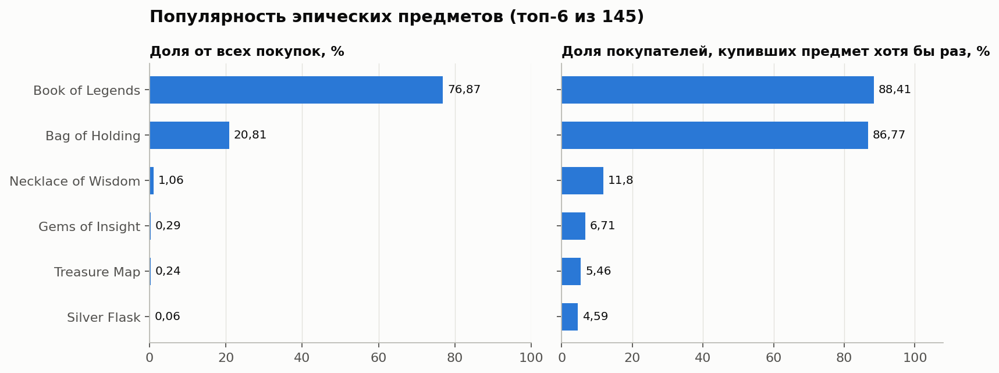
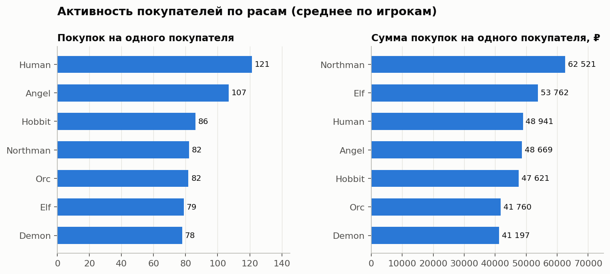

# Секреты Тёмнолесья: анализ платящих игроков и внутриигровых покупок (SQL)

Учебный проект аналитика данных на SQL. По данным игры «Секреты Тёмнолесья» нужно понять, какая доля игроков покупает внутриигровую валюту «райские лепестки» за реальные деньги, зависит ли это от расы персонажа и как игроки тратят валюту на эпические предметы.

**Инструменты:** SQL (PostgreSQL), DBeaver — CTE, JOIN, агрегатные функции, `PERCENTILE_CONT`, подзапросы.

Скрипт с запросами: [`Секреты Темнолесья.sql`](%D0%A1%D0%B5%D0%BA%D1%80%D0%B5%D1%82%D1%8B%20%D0%A2%D0%B5%D0%BC%D0%BD%D0%BE%D0%BB%D0%B5%D1%81%D1%8C%D1%8F.sql)

---

## Бизнес-контекст

Команде игры важно знать:
- какая доля игроков платит за «райские лепестки» и влияет ли на это раса персонажа;
- как игроки совершают внутриигровые покупки: сколько они стоят, какие эпические предметы популярны;
- правда ли, что игра за разные расы требует примерно одинакового числа покупок эпических предметов (гипотеза аналитиков: за некоторые расы играть сложнее).

## Данные

Схема `fantasy`, использованные таблицы и поля:

| Таблица | Поля | Что содержит |
|---|---|---|
| `users` | `id`, `race_id`, `payer` | Игроки: раса персонажа и признак «покупал валюту за реальные деньги» (1/0) |
| `race` | `race_id`, `race` | Справочник рас |
| `events` | `id` (игрок), `item_code`, `amount` | Внутриигровые покупки эпических предметов за «райские лепестки» |
| `items` | `item_code`, `game_items` | Справочник эпических предметов |

Объём: **22 214 игроков**, **1 307 678 покупок**, 145 предметов, которые покупали.

## Что сделано

**Часть 1. Исследовательский анализ**
1. Доля платящих игроков по всей игре и в разрезе рас.
2. Статистика по стоимости покупок: количество, сумма, минимум, максимум, среднее, медиана, стандартное отклонение.
3. Поиск аномальных покупок с нулевой стоимостью, их доля. Дальше во всех расчётах такие покупки исключены.
4. Популярность эпических предметов: число покупок, доля от всех покупок, доля игроков-покупателей, хоть раз купивших предмет.

**Часть 2. Ad hoc задача:** зависимость активности игроков от расы (число покупателей и их доля, доля платящих среди покупателей, среднее число покупок, средняя стоимость покупки и средняя сумма покупок на игрока).

---

## Результаты

### Доля платящих игроков
Платит **3 929 из 22 214 игроков — 17,7%**.



| Раса | Платящих | Всего игроков | Доля платящих |
|---|---|---|---|
| Angel | 229 | 1 327 | 17,3% |
| Demon | 238 | 1 229 | 19,4% |
| Elf | 427 | 2 501 | 17,1% |
| Hobbit | 659 | 3 648 | 18,1% |
| Human | 1 114 | 6 328 | 17,6% |
| Northman | 626 | 3 562 | 17,6% |
| Orc | 636 | 3 619 | 17,6% |

### Стоимость покупок

| Показатель | Значение |
|---|---|
| Количество покупок | 1 307 678 |
| Суммарная стоимость | 686 615 000 |
| Минимум / максимум | 0 / 486 615,1 |
| Среднее | 525,69 |
| Медиана | 74,86 |
| Стандартное отклонение | 2 517,35 |

Покупок с нулевой стоимостью — **907 (0,069%)**.

### Популярные эпические предметы



| Предмет | Покупок | Доля от всех покупок | Доля покупателей, купивших хоть раз |
|---|---|---|---|
| Book of Legends | 1 004 516 | 76,87% | 88,41% |
| Bag of Holding | 271 875 | 20,81% | 86,77% |
| Necklace of Wisdom | 13 828 | 1,06% | 11,8% |
| Gems of Insight | 3 833 | 0,29% | 6,71% |
| Treasure Map | 3 084 | 0,24% | 5,46% |

### Активность по расам (ad hoc)



| Раса | Игроков | Покупателей | Доля покупателей | Платящих среди покупателей | Покупок на игрока | Средняя стоимость покупки | Сумма на игрока |
|---|---|---|---|---|---|---|---|
| Angel | 1 327 | 820 | 61,8% | 16,7% | 106,8 | 775,55 | 48 668,65 |
| Demon | 1 229 | 737 | 60,0% | 19,9% | 77,9 | 735,48 | 41 197,38 |
| Elf | 2 501 | 1 543 | 61,7% | 16,3% | 78,8 | 791,84 | 53 761,65 |
| Hobbit | 3 648 | 2 266 | 62,1% | 17,7% | 86,1 | 699,90 | 47 620,92 |
| Human | 6 328 | 3 921 | 62,0% | 18,0% | 121,4 | 733,62 | 48 941,01 |
| Northman | 3 562 | 2 229 | 62,6% | 18,2% | 82,1 | 781,05 | 62 520,66 |
| Orc | 3 619 | 2 276 | 62,9% | 17,4% | 81,7 | 709,44 | 41 760,04 |

---

## Выводы

**Платящие игроки и раса.** Валюту за реальные деньги покупает около **17,7%** игроков. Раса влияет слабо: доля колеблется от 17,1% (Elf) до 19,4% (Demon), то есть разница не больше 2,3 процентного пункта.

**Стоимость покупок.** Всего совершено 1,31 млн покупок. Среднее (525,69) в 7 раз выше медианы (74,86), а стандартное отклонение (2 517) почти в 5 раз выше среднего: типичная покупка дешёвая, но небольшое число очень крупных покупок сильно поднимает среднее (максимум 486 615).

**Аномалии.** Найдено 907 покупок с нулевой стоимостью — 0,069% от всех, то есть их мало, но они не приносят валюту и исключены из дальнейших расчётов. Отдельно стоит проверить верхние выбросы: максимальная покупка в тысячи раз больше медианы.

**Популярные предметы.** Явных лидеров два — **Book of Legends** и **Bag of Holding**: на них приходится 97,7% всех покупок, и каждый хоть раз купили около 87–88% игроков-покупателей. Следующий по популярности предмет (Necklace of Wisdom) составляет всего 1,06% покупок.

**Ad hoc: зависимость от расы.** Во всех расах покупки совершают примерно одинаковая доля игроков (60–63%), но интенсивность различается. Больше всего покупок на одного игрока у Human (121) и Angel (107), меньше всего у Demon (78) и Elf (79): разница до 1,6 раза. По сумме трат впереди Northman (62,5 тыс.), меньше всех тратят Demon и Orc (около 41 тыс.). **Гипотеза разработчиков о примерно равном числе покупок по расам не подтверждается:** за Human и Angel игроки покупают заметно чаще, хотя ни одна раса не выглядит «самой трудной» сразу по всем показателям.

## Рекомендации маркетингу

1. **Не сегментировать платящих по расе.** Доля платящих почти одинакова (17–19%), поэтому раса плохо предсказывает, кто заплатит. Точнее делить игроков по поведению: частоте и размеру покупок.
2. **Опираться на два главных предмета.** Book of Legends и Bag of Holding покупает почти каждый покупатель: на них удобно строить акции и наборы. Остальные 143 предмета из тех, что покупали, почти не продаются, стоит проверить их цену, заметность в магазине и пользу для игрока.
3. **Учитывать перекос в стоимости покупок.** Типичная покупка стоит около 75, а среднее завышено единичными крупными тратами. Для массовых игроков подойдут небольшие пакеты предложений, а крупных покупателей стоит выделить в отдельный сегмент.
4. **Проверить баланс для Human и Angel.** Игроки этих рас покупают заметно чаще остальных, возможно, им сложнее проходить игру. У Demon наоборот: самая высокая доля платящих (19,4%), но самое малое число покупок и сумма, здесь есть потенциал для предложений платящим игрокам.
5. **Проверить данные.** Разобраться с 907 нулевыми покупками (ошибки, подарки) и с предметом «Treasure Map», который встречается в справочнике дважды с разными кодами.

## Ограничения

- Средние значения по игрокам чувствительны к очень крупным покупкам: для более надёжного вывода по расам стоит дополнительно посчитать медианы.
- В данных нет времени покупок, поэтому динамику и сезонность оценить нельзя.
- Число покупок не измеряет сложность прохождения напрямую: это только косвенный признак.

## Структура репозитория

```
├── README.md
├── Секреты Темнолесья.sql     # все запросы проекта
└── images/                    # графики для README
```
