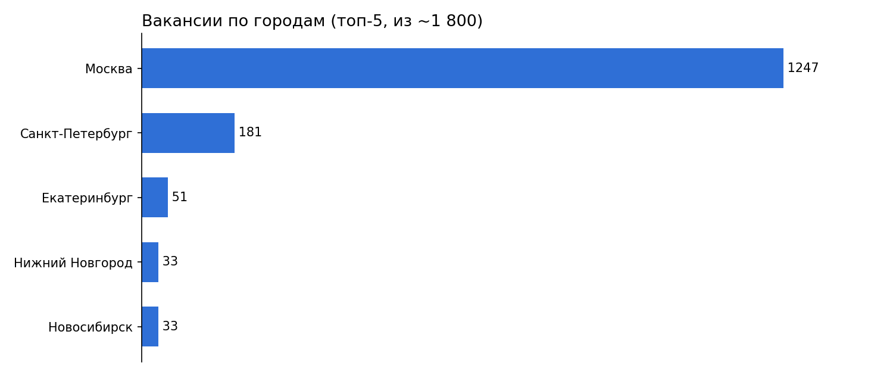
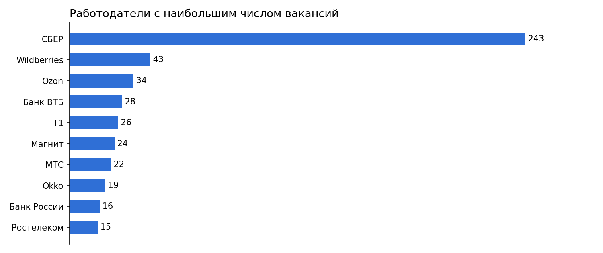
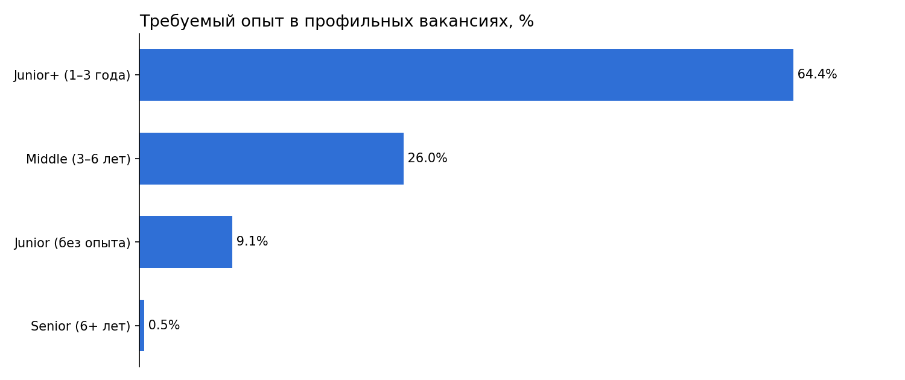
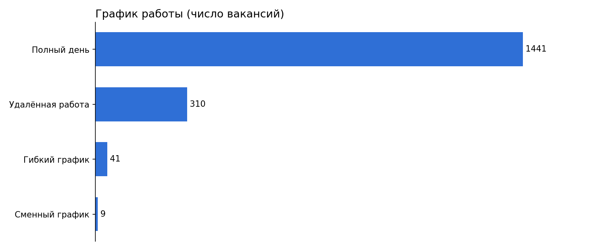

# Рынок вакансий аналитиков данных на HH.ru

**Задача.** Разобраться, как устроен рынок труда для аналитиков данных и системных аналитиков: сколько платят, где и кто нанимает, какой опыт и навыки требуют.

**Данные.** Таблица `public.parcing_table` — около 1 800 вакансий, выгруженных с HH.ru: зарплатная вилка, город, работодатель, тип занятости, график, опыт, ключевые навыки.

**Стек.** SQL (PostgreSQL): агрегации, CTE, оконные функции, `ILIKE`.

## Ключевые результаты

- **Зарплаты.** Средняя вилка — от ~110 до ~154 тыс. руб. В данных есть явные ошибки ввода (зарплата «от 50 руб.»), поэтому средние значения приблизительные.
- **География.** Москва — ~70% вакансий (1 247), Санкт-Петербург — ~10% (181). Из регионов лидирует Екатеринбург (51).
- **Работодатели.** СБЕР — 243 вакансии (~13% рынка), дальше Wildberries, Ozon, ВТБ, Т1. Спрос формируют банки и e-commerce.
- **Условия.** ~98% вакансий — полная занятость; удалённую работу предлагает ~17%.
- **Грейд.** Среди профильных вакансий 64% — Junior+ (1–3 года опыта), 26% — Middle, без опыта — только 9%, Senior — меньше 1%.
- **Навыки.** По первому навыку в списке лидируют «Анализ данных», SQL, «Документация» и MS SQL.

## Выводы

Вход в профессию без опыта узкий (менее 10% вакансий), а основной спрос — на специалистов с 1–3 годами опыта. Для новичка критичны SQL и подтверждённые проекты. Рынок сосредоточен в Москве, но удалёнка (~17% вакансий) даёт доступ к нему из регионов.

## Ограничения

- Зарплата указана не во всех вакансиях, есть ошибки ввода; средние «от» и «до» считаются по разным подмножествам вакансий и напрямую не сопоставимы.
- Навыки проанализированы только по первому столбцу `key_skills_1`, поэтому картина по конкретным технологиям (например, Python) неполная.
- «Профильные» вакансии отбираются по названию («аналитик данных», «системный аналитик»).
- Результаты запросов приведены в комментариях к скрипту; сами данные в репозиторий не включены.

## Файлы

- [`Вакансии аналитиков HH.ru.sql`](Вакансии%20аналитиков%20HH.ru.sql) — запросы, их результаты и выводы по каждому шагу.
- `images/` — графики, построенные по результатам запросов.
