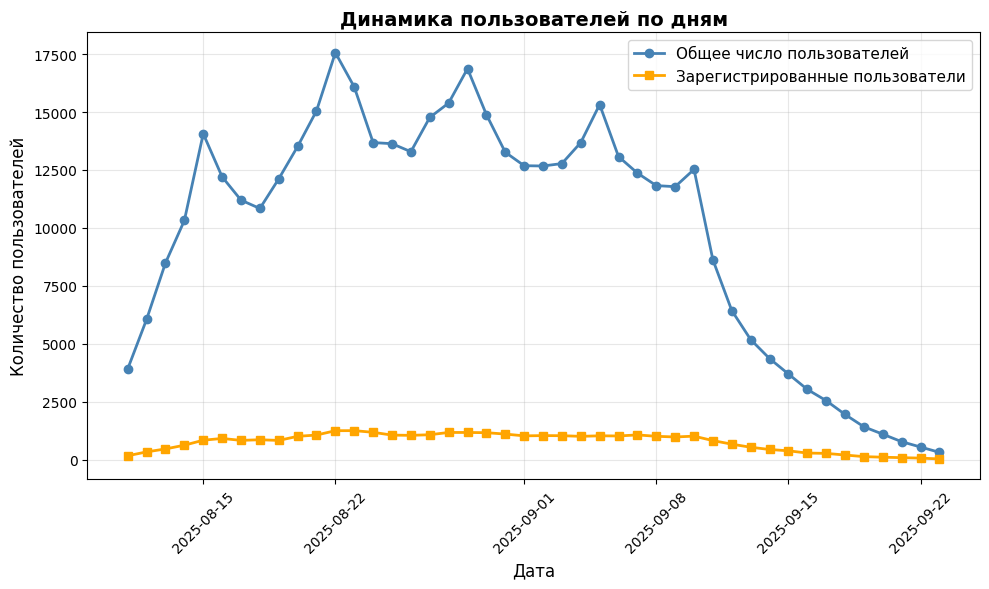
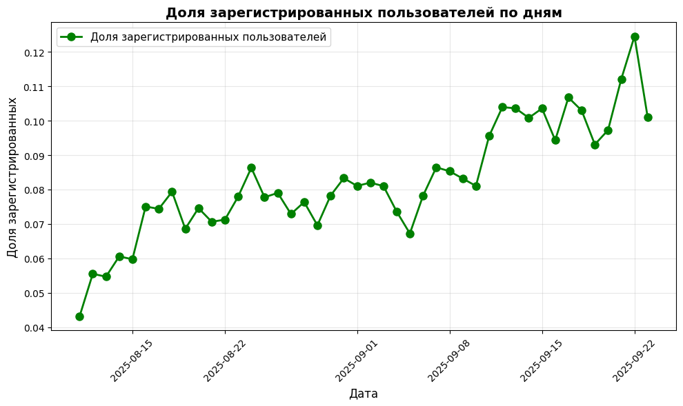
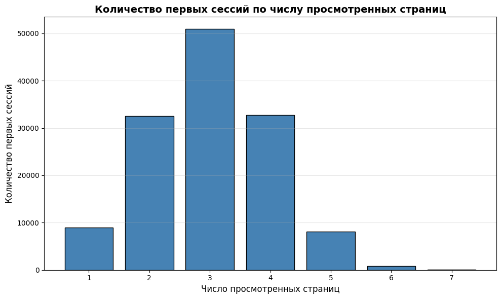
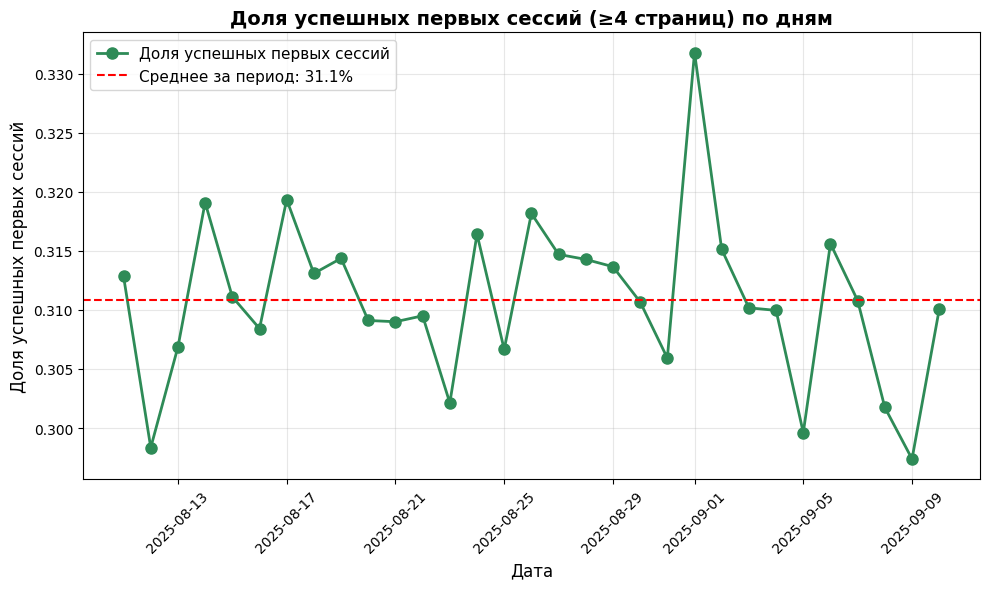
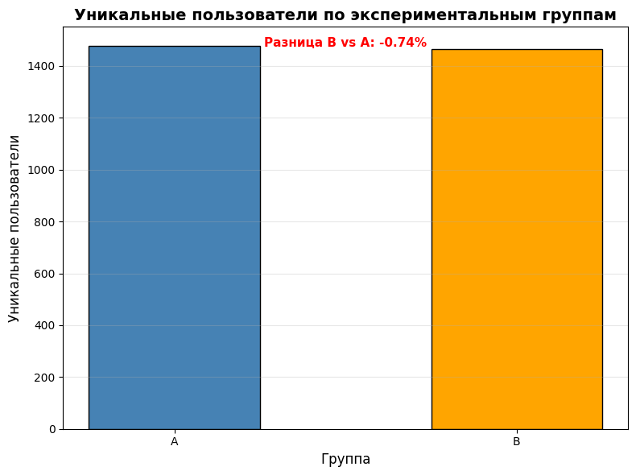
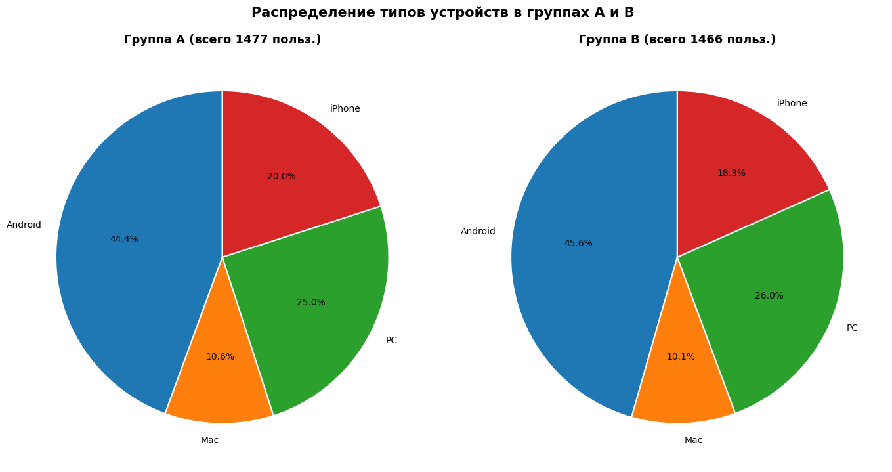
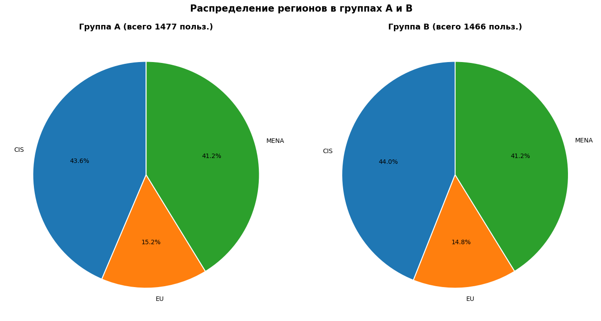

# A/B-тест нового алгоритма рекомендаций: планирование и анализ результатов

Проект по продуктовой аналитике. Приложение с «бесконечной» лентой контента (монетизация — подписка и реклама) тестирует новый алгоритм рекомендаций. Задача аналитика: рассчитать параметры A/B-теста, проверить корректность его проведения и оценить результаты.

## Цель
Проверить гипотезу: новый алгоритм рекомендаций повышает вовлечённость пользователей — долю успешных первых сессий (просмотрено 4 и более страниц).

## Данные
| Файл | Содержание |
|---|---|
| `sessions_project_history.csv` | исторические сессии пользователей, 2025-08-11 — 2025-09-23 |
| `sessions_project_test_part.csv` | данные за первый день теста, 2025-10-14 |
| `sessions_project_test.csv` | данные за весь тест, 2025-10-14 — 2025-11-02 |

Основные поля: `user_id`, `session_id`, `session_date`, `install_date`, `session_number`, `registration_flag`, `page_counter`, `region`, `device`, `test_group`. Данные читаются в ноутбуке напрямую с `https://code.s3.yandex.net/datasets/`.

## Ход работы
1. **EDA по историческим данным:** динамика пользователей и регистраций, распределение просмотренных страниц в первых сессиях, доля успешных первых сессий (≈31%, стабильна).
2. **Планирование теста:** размер выборки для MDE = 3% (от базового уровня 31%), α = 0,05, мощность 80% — 41 041 пользователь на группу; оценка длительности теста.
3. **Мониторинг теста (первый день):** сравнение размеров групп, проверка пересечений, баланс по устройствам и регионам.
4. **Анализ результатов:** односторонний z-тест для долей (H1: p_B > p_A).

## Результаты
- Группы сформированы корректно: разница в размерах −0,75%, пересечений нет, устройства и регионы распределены одинаково.
- Доля успешных первых сессий: **31,57% (A) и 31,47% (B)**, разница −0,11 п.п.; p-value = 0,578 — эффект статистически не значим.
- Тест набрал ≈15 тыс. пользователей на группу вместо плановых 41 тыс., поэтому он способен обнаружить эффект от ≈4%, а не от 3%.

**Вывод:** на основании этого теста новый алгоритм внедрять не стоит; прирост метрики не подтверждён. Чтобы окончательно ответить на вопрос о небольшом эффекте (≈3%), тест нужно продолжить до плановой выборки либо доработать алгоритм и проверить дополнительные метрики (число страниц, повторные сессии, регистрации).

## Графики








## Стек
Python, pandas, matplotlib, statsmodels (`NormalIndPower`, `proportion_effectsize`, `proportions_ztest`).

## Структура
```
AB-тест рекомендательного алгоритма/
├── README.md
├── AB-тест рекомендательного алгоритма.ipynb
└── images/
```
