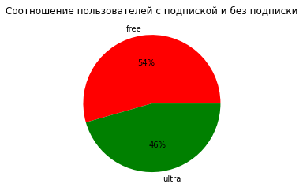
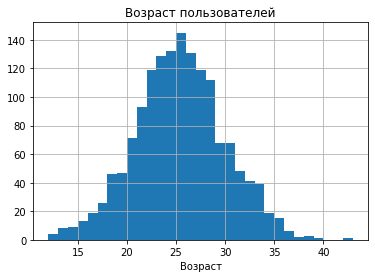
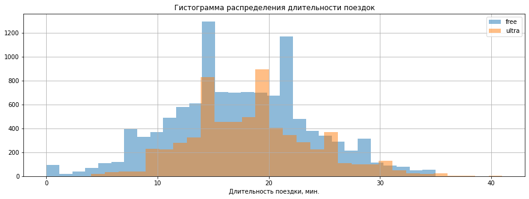
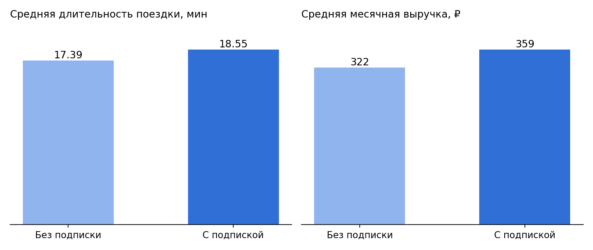

# Проверка гипотез в бизнесе: анализ сервиса проката самокатов GoFast

Проект по статистическому анализу данных. Сервис проката самокатов GoFast хочет увеличить число пользователей с платной подпиской Ultra. Задача — изучить пользователей и поездки, сравнить подписчиков с остальными и проверить продуктовые гипотезы.

## Цель
Оценить, выгодно ли компании распространение платной подписки, и подготовить рекомендации для продакт-менеджеров.

## Данные
| Таблица | Содержание |
|---|---|
| `users_go.csv` | пользователи: `user_id`, `name`, `age`, `city`, `subscription_type` (1565 строк) |
| `rides_go.csv` | поездки за 2021 год: `user_id`, `distance` (м), `duration` (мин), `date` (18 068 строк) |
| `subscriptions_go.csv` | тарифы: `minute_price`, `start_ride_price`, `subscription_fee` (2 строки: `free`, `ultra`) |

Данные читаются в ноутбуке напрямую с `https://code.s3.yandex.net/datasets/`.

## Ход работы
1. **Предобработка:** приведение даты к типу `datetime`, столбец с месяцем, удаление 31 дубликата (осталось 1534 пользователя), округление длительности поездок до целых минут.
2. **Исследовательский анализ:** города, соотношение подписок, возраст, длительность поездок.
3. **Объединение таблиц** и сравнение поездок пользователей с подпиской и без неё.
4. **Расчёт выручки** по пользователям и месяцам: `старт × число поездок + минутный тариф × время + плата за подписку`.
5. **Проверка гипотез** (t-тесты, α = 0,05).
6. **Моделирование нормальным распределением** (CDF и PPF из `scipy.stats`).

## Ключевые результаты
- Пользователи равномерно распределены по 8 городам; 46% пользователей с подпиской Ultra, 54% — без подписки. Основная аудитория — 20–30 лет, несовершеннолетних около 5%.
- Средняя поездка — 18 минут (в основном 14–22 минуты).
- **Гипотеза 1:** подписчики ездят дольше — 18,55 мин против 17,39 мин, p ≈ 3·10⁻³⁵.
- **Гипотеза 2:** нет оснований считать, что подписчики в среднем проезжают больше оптимальных 3130 м за поездку (p ≈ 0,92).
- **Гипотеза 3:** подписчики приносят больше месячной выручки — 359 ₽ против 322 ₽, p ≈ 2·10⁻³⁷.
- **Нормальная модель:** доля поездок подписчиков дольше 30 минут — около 2%; от 20 до 30 минут — около 37,7%; 90-й процентиль дистанции — ≈ 4 502 м.

**Вывод:** пользователи с подпиской выгоднее компании (больше выручки, нет избыточного износа), поэтому продвижение подписки оправдано. Скидка на поездки дольше 30 минут затронет лишь ≈ 2% поездок, поэтому лучше рассмотреть промоакцию для поездок 20–30 минут и доплату за дистанцию свыше ≈ 4,5 км.

## Графики





## Ограничения
- Тесты проводились на данных отдельных поездок, а поездки одного пользователя не полностью независимы.
- Нормальное распределение длительности и дистанции — упрощающее допущение.

## Стек
Python, pandas, matplotlib, SciPy (`ttest_ind`, `ttest_1samp`, `norm`).

## Структура
```
Анализ сервиса GoFast и проверка гипотез/
├── README.md
├── Анализ сервиса GoFast и проверка гипотез.ipynb
└── images/
```
