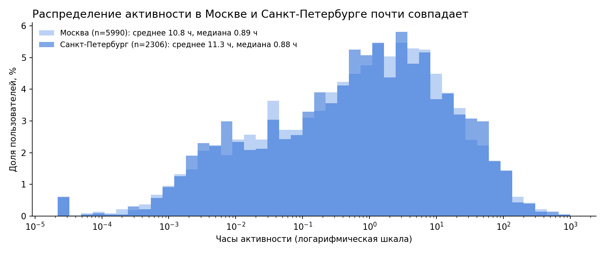
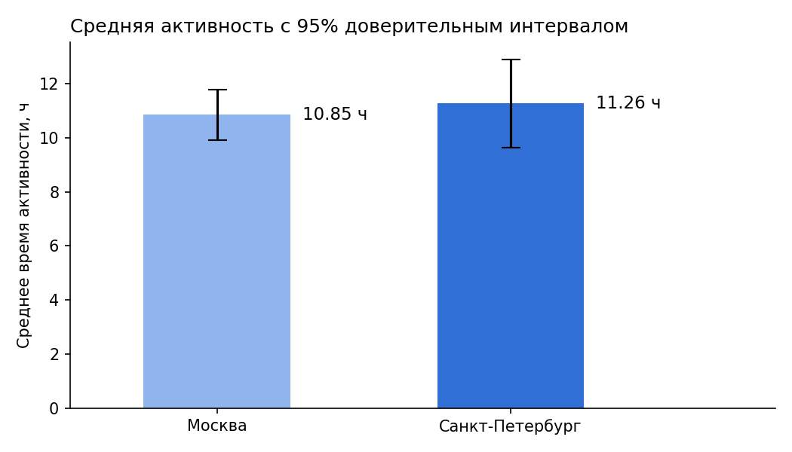
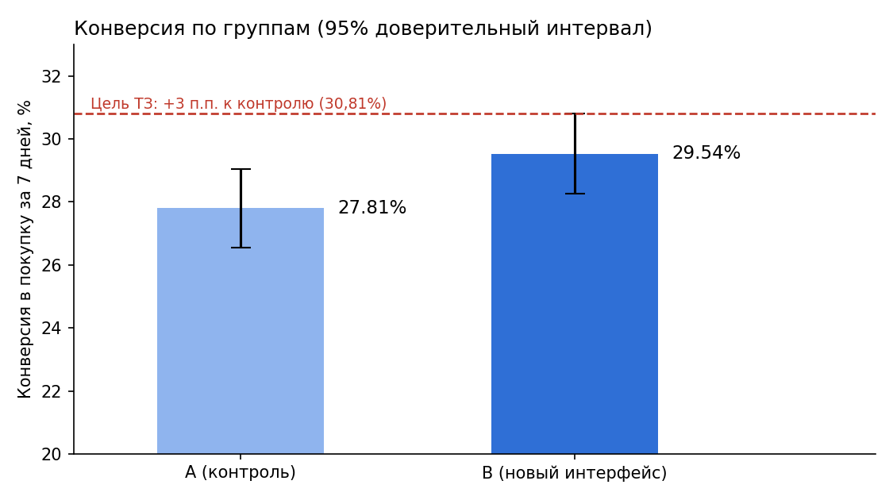

# Проверка гипотез и анализ A/B-теста: Яндекс Книги и интернет-магазин BitMotion Kit

Проект по статистике для продуктовой аналитики. Две независимые части: проверка гипотезы о времени чтения и прослушивания в Яндекс Книгах и оценка результатов A/B-теста нового интерфейса интернет-магазина.

## Часть 1. Яндекс Книги: Москва и Санкт-Петербург

**Гипотеза:** пользователи из Санкт-Петербурга проводят в приложении больше времени, чем пользователи из Москвы.
- H₀: средняя активность в двух городах не различается;
- H₁: средняя активность в Санкт-Петербурге больше.

**Данные:** `data/yandex_knigi_data.csv` — город, идентификатор пользователя `puid` и суммарные часы активности (`hours`), предварительно рассчитанные SQL-запросами по данным сервиса за 1 сентября – 11 декабря 2024 года.

**Ход работы**
1. Проверка данных: пропусков и полных дубликатов нет, но 244 пользователя (2,9%) встречаются одновременно в обеих группах. Это нарушает независимость выборок, поэтому все их записи (488 строк) удалены. Осталось 8 296 строк: 5 990 из Москвы и 2 306 из Санкт-Петербурга.
2. Сравнение групп: средняя активность 10,85 ч (Москва) и 11,26 ч (СПб), медианы почти одинаковые — 0,89 и 0,88 ч.
3. Односторонний t-тест Уэлча (группы разного размера, дисперсии не равны), α = 0,05.

**Результат:** p-value = 0,332 > 0,05 — нулевая гипотеза не отвергается. Разница в 0,42 ч статистически не значима.

**Возможные причины:** сильно скошенное распределение (медиана < 1 ч при среднем ≈ 11 ч, разброс в 3–4 раза больше среднего) — активность определяет небольшая группа очень активных пользователей, а не город; выборка СПб в 2,6 раза меньше московской, что снижает чувствительность теста.




## Часть 2. A/B-тест упрощённого интерфейса BitMotion Kit

**Задача:** проверить корректность теста `interface_eu_test` и оценить, вырастет ли за 7 дней после регистрации конверсия в покупку не менее чем на 3 п.п. (группа A — контроль, B — новый интерфейс).

**Ход работы**
1. Проверка распределения: группы сбалансированы (A — 5 383, B — 5 467), конфликтов групп внутри теста нет.
2. Пересечение с конкурирующим тестом `recommender_system_test`: 887 пользователей (8,2%) исключены. После очистки: A — 4 952, B — 5 011.
3. Горизонт анализа: у всех 9 963 участников одна регистрация, регистрации до 24.12.2020, данные до 31.12.2020 — 7-дневное окно полное.
4. Размер выборки для эффекта 3 п.п. (базовая конверсия 30%, мощность 80%, α = 0,05): 3 762 на группу — выборок достаточно.
5. Односторонний z-тест для двух долей (H1: конверсия B выше).

**Результат:** конверсия 27,81% в группе A и 29,54% в группе B (+1,73 п.п.), z = 1,907, p-value = 0,028 — рост статистически значим. Но он меньше порога +3 п.п. из технического задания.

**Вывод:** новый интерфейс улучшает конверсию, случайность исключена при α = 0,05, однако заявленную цель +3 п.п. тест не подтвердил. Стоит продлить тест для уточнения оценки либо доработать интерфейс.



> Примечание: 95% доверительный интервал для разницы конверсий — примерно от −0,05 до +3,50 п.п., то есть он включает и нулевой эффект, и цель ТЗ в 3 п.п. Поэтому вывод о том, что цель «не достигнута», стоит формулировать осторожно.

## Стек
Python, pandas, SciPy (`ttest_ind`), statsmodels (`proportions_ztest`, `proportion_effectsize`, `zt_ind_solve_power`), matplotlib (графики для README).

## Структура
```
Яндекс Книги и AB-тест интерфейса/
├── README.md
├── Яндекс Книги и AB-тест интерфейса.ipynb
├── data/
│   └── yandex_knigi_data.csv
└── images/
```
Данные части 2 (`ab_test_participants.csv`, `ab_test_events.zip`) читаются в ноутбуке напрямую с `https://code.s3.yandex.net/datasets/`.
