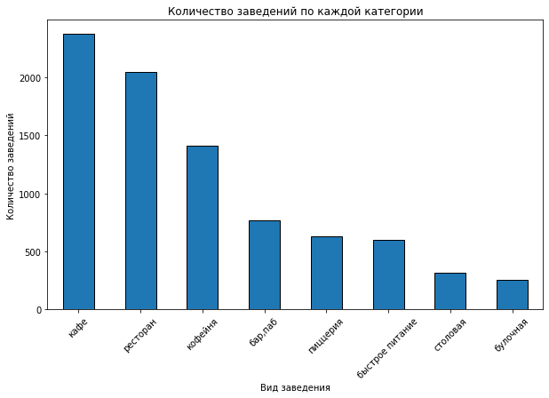
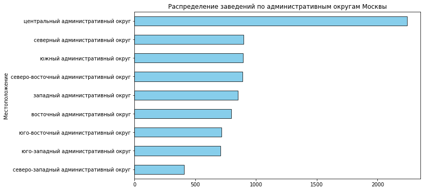
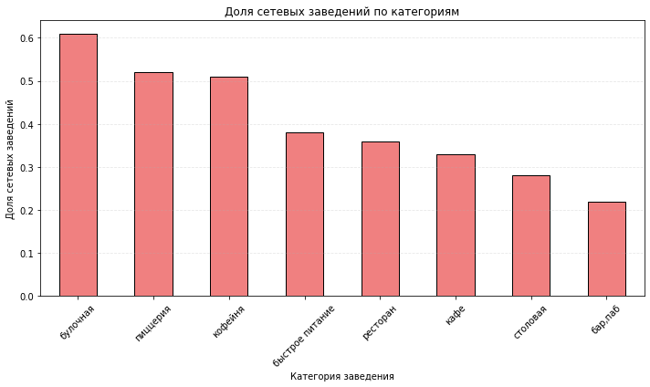
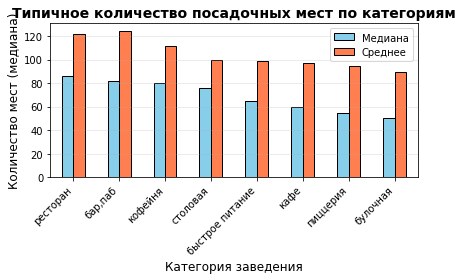
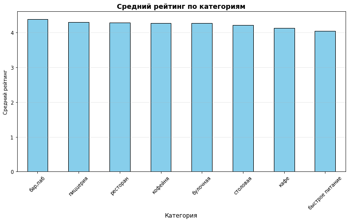
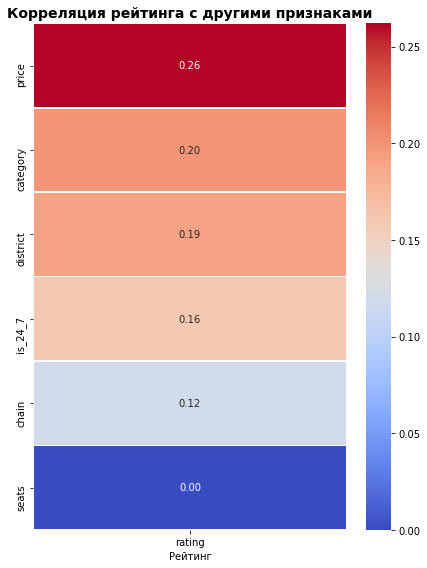
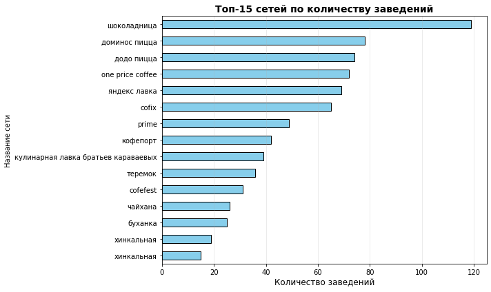
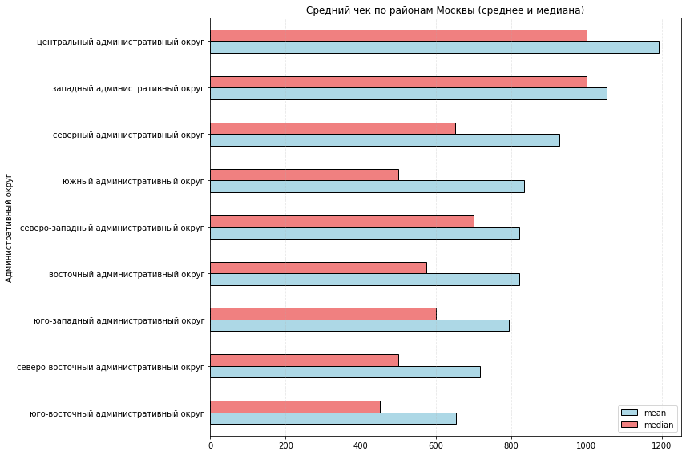

# Исследование рынка общественного питания Москвы (Python)

Учебный проект аналитика данных. Инвесторы фонда «Shut Up and Take My Money» хотят открыть заведение общественного питания в Москве, но ещё не знают, что это будет: кафе, ресторан или бар. Задача — провести исследовательский анализ рынка и подсказать, какой формат и какой район выбрать.

**Инструменты:** Python, pandas, matplotlib, seaborn, phik (коэффициент корреляции φK для категориальных признаков), Jupyter Notebook.

**Ноутбук:** [`Анализ рынка общепита Москвы.ipynb`](%D0%90%D0%BD%D0%B0%D0%BB%D0%B8%D0%B7%20%D1%80%D1%8B%D0%BD%D0%BA%D0%B0%20%D0%BE%D0%B1%D1%89%D0%B5%D0%BF%D0%B8%D1%82%D0%B0%20%D0%9C%D0%BE%D1%81%D0%BA%D0%B2%D1%8B.ipynb) (все расчёты, графики и выводы внутри)

---

## Данные

Два учебных датасета по заведениям Москвы на лето 2022 года (Яндекс Карты и Яндекс Бизнес). В репозитории они не хранятся.

| Файл | Что содержит |
|---|---|
| `rest_info.csv` | Название, адрес, административный округ, категория, часы работы, рейтинг, признак сетевого заведения, число посадочных мест |
| `rest_price.csv` | Ценовая категория, строка со средним чеком, оценка среднего чека и цены чашки капучино в рублях |

Таблицы объединены по `id`: **8 406 заведений**, 13 столбцов.

## Что сделано

1. **Знакомство с данными.** Проверил размеры, типы, пропуски, соответствие описанию; объединил два датасета.
2. **Предобработка.** Понизил разрядность числовых типов; изучил пропуски в шести столбцах (`hours` 6,4%, `seats` 43%, `price` 61%, `avg_bill` 55%, `middle_avg_bill` 63%, `middle_coffee_cup` 94%) и оставил их без изменений, чтобы не исказить данные; нормализовал текстовые столбцы; нашёл и удалил 4 неявных дубликата (одинаковые название и адрес), это 0,05% данных; создал признак `is_24_7` (работает ежедневно и круглосуточно, таких 730 заведений).
3. **Исследовательский анализ:** категории, округа, сетевые и несетевые заведения, посадочные места и выбросы, рейтинги, корреляция рейтинга с другими признаками (φK), топ-15 сетей, средний чек по округам.
4. **Итоговые выводы и рекомендации.**

Итого в анализе **8 402 заведения**.

---

## Результаты

### Категории и районы



Три формата занимают **69,4%** рынка: кафе (28,3%), рестораны (24,3%) и кофейни (16,8%). Дальше идут бары и пабы (9,1%), пиццерии (7,5%), быстрое питание (7,2%), столовые (3,8%) и булочные (3,1%).



**Центральный округ (ЦАО) — 2 242 заведения, 27% рынка**, почти в 2,5 раза больше любого другого округа. Семь округов близки друг к другу (700–900 заведений), меньше всех в Северо-Западном (409). В ЦАО на первом месте рестораны (29,9%), затем кафе (20,7%) и кофейни (19,1%), а по Москве в целом лидирует кафе.

### Сетевые и несетевые заведения



Несетевых заведений больше: **61,9%** (5 199) против 38,1% сетевых (3 203). Чаще всего сетевыми бывают булочные (61%), пиццерии (52%) и кофейни (51%). Реже всего — бары и пабы (22%), столовые (28%) и кафе (33%).

### Посадочные места

Пропущено 43% значений, в оставшихся 4 792 заведениях **медиана — 75 мест**, среднее — 108, максимум — 1 288. Среднее сдвинуто вправо за счёт крупных залов, поэтому типичным считаем медиану. Встречаются и нулевые значения (возможно, заведения на вынос или ошибки в данных).



| Категория | Медиана мест | Среднее |
|---|---|---|
| Ресторан | 86 | 122 |
| Бар, паб | 82 | 124 |
| Кофейня | 80 | 111 |
| Столовая | 75,5 | 100 |
| Быстрое питание | 65 | 99 |
| Кафе | 60 | 97 |
| Пиццерия | 55 | 94 |
| Булочная | 50 | 89 |

### Рейтинги



Средние рейтинги по категориям близки: от 4,05 (быстрое питание) до 4,39 (бары и пабы), то есть разница около 0,34 балла. Ниже всех оценивают быстрое питание (4,05) и кафе (4,12), и у них же самый большой разброс оценок (стандартное отклонение около 0,56).



Все признаки связаны с рейтингом слабо. Сильнее остальных — **ценовая категория (φK = 0,26)**, затем категория (0,20), округ (0,19), круглосуточная работа (0,16), сетевой статус (0,12); число мест с рейтингом не связано (0,00). Средний рейтинг растёт вместе с ценой: «низкие» — 4,17, «средние» — 4,30, «выше среднего» — 4,39, «высокие» — 4,44.

### Топ сетей



Самая крупная сеть — «Шоколадница» (119 заведений, рейтинг 4,18). В топе много кофеен и пиццерий («Домино'с Пицца» — 78, «Додо Пицца» — 74, One Price Coffee — 72). Самый низкий рейтинг у «Яндекс Лавки» (3,87), самые высокие у небольших сетей: «Буханка» (4,42) и «Кулинарная лавка братьев Караваевых» (4,39).

### Средний чек по округам



Самый высокий средний чек в ЦАО (**1 191 ₽**), затем идут Западный (1 053 ₽) и Северный (928 ₽) округа. Самый низкий — в Юго-Восточном (**654 ₽**), то есть в ЦАО чек примерно на 82% выше. В целом чек снижается при удалении от центра, но не строго: Западный округ выше, чем ближе расположенные к центру.

---

## Выводы

- Рынок зрелый: около 70% заведений — кафе, рестораны и кофейни. Быстрое питание, столовые и булочные занимают небольшие доли.
- Заведения сильно сконцентрированы в центре (27% всех данных).
- Преобладают независимые заведения, но кофейни, пиццерии и булочные активно масштабируются через сети.
- Типичное заведение — около 75 посадочных мест, для ресторанов, баров и кофеен — 80–86.
- Рейтинги по категориям почти не различаются и лишь слабо связаны с ценой: качество оценок определяется другими факторами (сервис, кухня, атмосфера), которых нет в данных.
- Цены заметно зависят от расположения: чем ближе к центру, тем выше средний чек.

## Рекомендации инвесторам

1. **Формат.** Кофейня или пиццерия — сетевые форматы с проверенным спросом. Если нужен независимый проект, стоит присмотреться к менее сетевым категориям (кафе, бары), где важнее уникальная концепция. Рестораны — самая конкурентная ниша, выходить туда стоит только с сильной концепцией.
2. **Район.** ЦАО подходит для премиального проекта с высоким чеком, но там самая высокая конкуренция. Для формата «средний чек» стоит смотреть на Западный, Северный и Северо-Западный округа, где заведений меньше, а чек ещё заметно выше, чем на юго-востоке.
3. **Размер.** Ориентироваться на 50–90 мест. Большие залы (150+) оправданы только для ресторанов с сильной концепцией и столовых в местах скопления людей.
4. **Качество.** Рейтинг слабо зависит от формата и района, поэтому решающими будут сервис и продукт. Высокая цена сама по себе не гарантирует высокого рейтинга, но заведения дороже в среднем оцениваются выше.

## Ограничения

- Данные на лето 2022 года, справочные (часть информации вносили пользователи).
- Признак `chain` для небольших сетей может содержать ошибки (указано в описании данных).
- Пропуски в `seats`, `price` и `middle_avg_bill` большие (43–63%), поэтому выводы по этим столбцам относятся только к заведениям с заполненными значениями.
- Рейтинг измеряет удовлетворённость посетителей, а не прибыльность: данных о выручке, арендной ставке и расходах нет.

## Структура репозитория

```
├── README.md
├── Анализ рынка общепита Москвы.ipynb   # ноутбук с анализом и выводами
└── images/                               # графики для README
```
