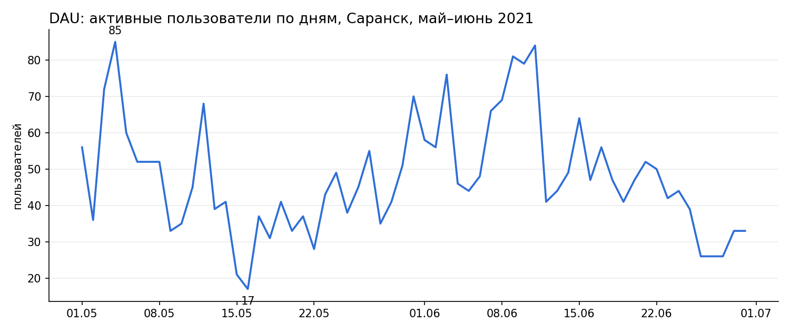
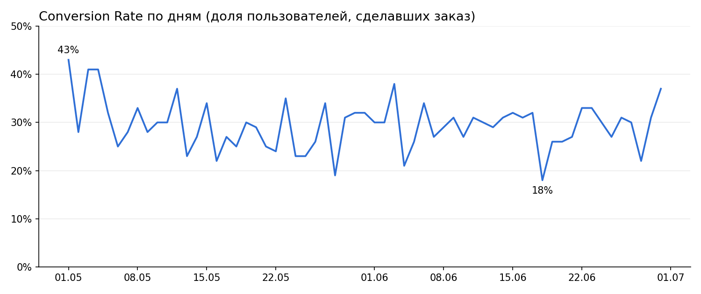
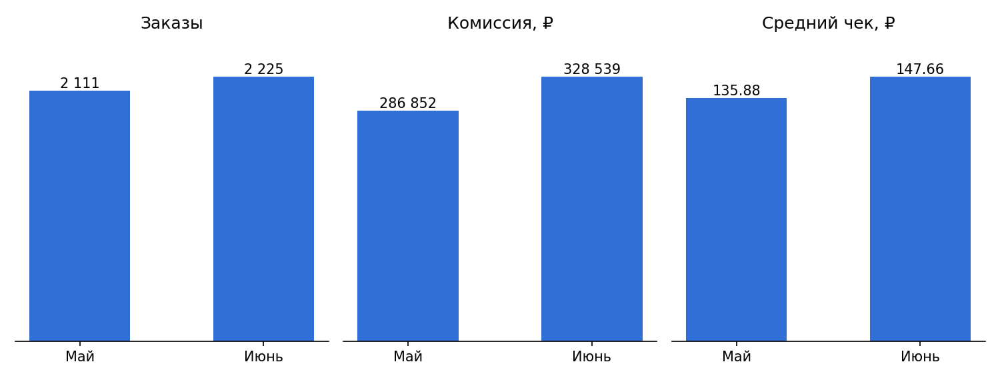
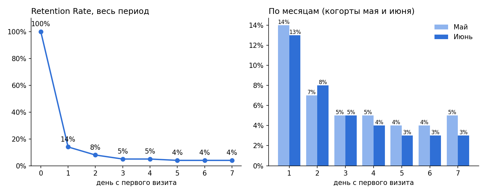
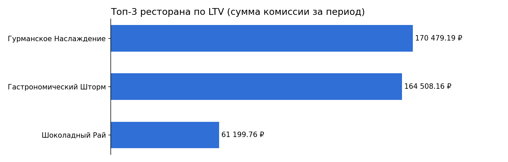
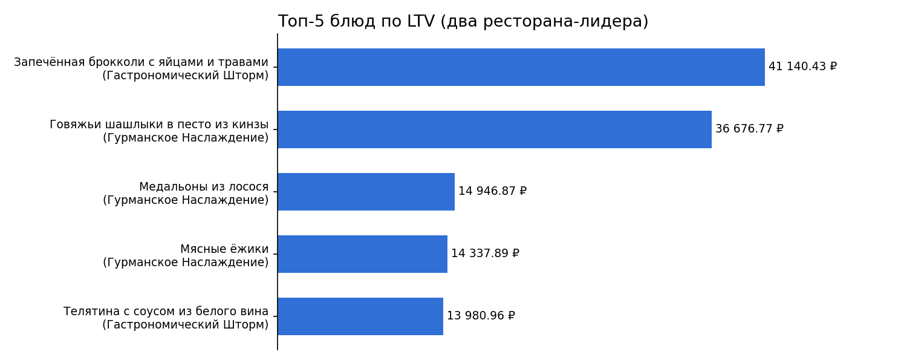

# Дашборд и аналитическая записка: сервис доставки «Всё.из.кафе», Саранск

Проект по визуализации данных: дашборд в Yandex DataLens с ключевыми метриками сервиса доставки еды за **1 мая – 30 июня 2021 года** и аналитическая записка с выводами и рекомендациями для бизнеса.

**Дашборд (DataLens):** https://datalens.yandex/ib06zmfdvibe1
На дашборде две вкладки: «Дашборт» (7 чартов) и «Аналитическая записка».

## Цель
Оценить динамику DAU, конверсии, среднего чека, удержания пользователей и LTV ресторанов, найти точки роста и предложить корректирующие действия.

## Данные
Схема `rest_analytics` (PostgreSQL): `analytics_events` (события пользователей: просмотры, заказы, выручка, комиссия), `cities`, `partners` (рестораны и сети), `dishes` (блюда). Фильтр: город «Саранск», период 01.05–30.06.2021.

## Метрики на дашборде
| Метрика | Что показывает |
|---|---|
| DAU | число уникальных пользователей с заказом за день |
| Conversion Rate | доля пользователей, сделавших заказ, от всех активных за день |
| Средний чек | комиссия сервиса на один заказ по месяцам |
| Retention Rate | доля новых пользователей, вернувшихся на 1–7 день (в целом и по месяцам) |
| LTV ресторанов | суммарная комиссия по ресторану за период (топ-3) |
| LTV блюд | суммарная комиссия по блюду (топ-5 в двух ресторанах-лидерах) |

Чарты построены на SQL-запросах (QL-чарты DataLens): фильтрация по городу и периоду, `COUNT(DISTINCT ...)`, `FILTER`, CTE и оконные функции для удержания.

## Ключевые результаты
- **DAU:** устойчивого тренда нет (17–85 в день); июнь выше мая (≈50 против ≈45), но к концу июня спад до 26.
- **Конверсия:** ≈30% и почти не меняется (май ≈29,6%, июнь ≈29,3%).
- **Средний чек:** 135,88 ₽ → 147,66 ₽ (+8,7%), комиссия +14,5% (286 852 → 328 539 ₽).
- **Удержание:** 14% на 1-й день и 3–5% на 7-й — главная проблема продукта.
- **LTV:** «Гурманское Наслаждение» (170 479 ₽) и «Гастрономический Шторм» (164 508 ₽) в 2,7–2,8 раза опережают «Шоколадный Рай» (61 200 ₽).

Главная рекомендация — работать с удержанием новых пользователей (лояльность, push, повторные акции), затем с качеством трафика и конверсией.

## Графики







> Графики в README перестроены по данным дашборда для наглядности; интерактивная версия — по ссылке на DataLens.

## Ограничения
- «Средний чек» на дашборде — это комиссия сервиса на заказ, а не сумма, которую платит клиент.
- DAU считается только по пользователям с заказом (`event = 'order'`), поэтому DAU и знаменатель конверсии определены по-разному.
- Когорты удержания ограничены датой первого визита до 24.06, чтобы у каждого был полный 7-дневный горизонт.
- Топ-5 блюд считается только по двум ресторанам-лидерам (по SQL-запросу), «Шоколадный Рай» в него не входит.
- В данных по блюдам у некоторых позиций (например, брокколи) одновременно стоят признаки `fish = 1` и `meat = 1` — стоит проверить справочник.

## Аналитическая записка
Полный текст: [Аналитическая записка.md](Аналитическая%20записка.md)

## Структура
```
Всё.из.кафе/
├── README.md
├── Аналитическая записка.md
└── images/
```
