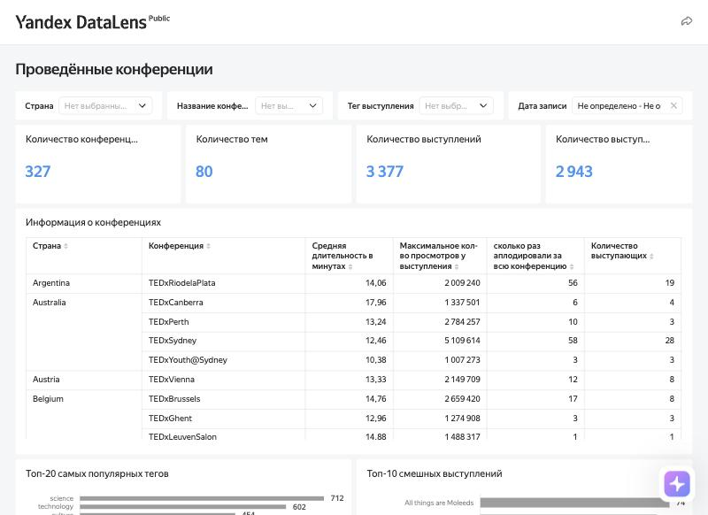
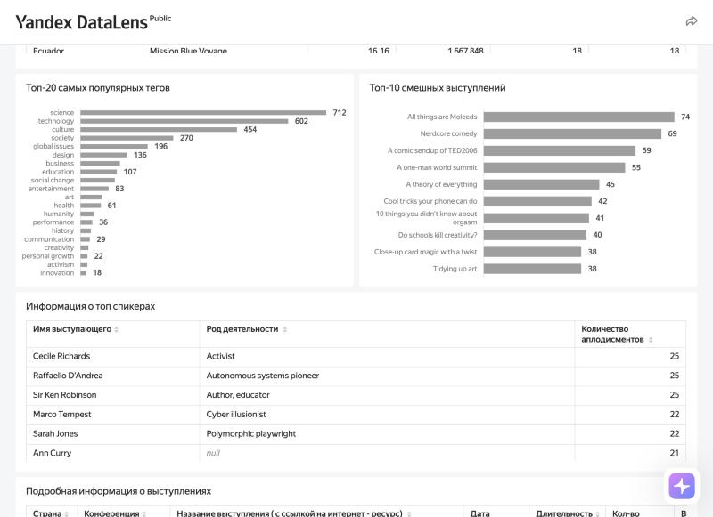
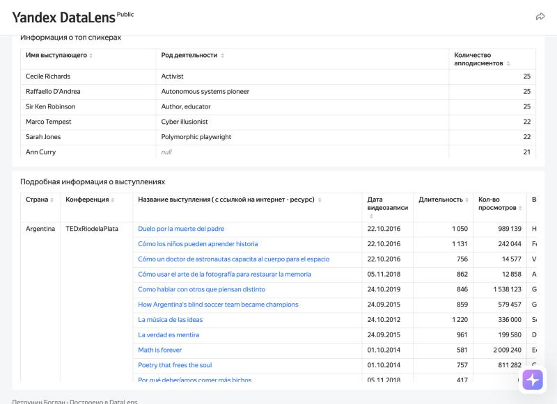

# Дашборд по конференциям TED (Yandex DataLens)

Учебный BI-проект: интерактивный дашборд для организатора первой конференции TED. Он помогает понять, какие темы и выступающие были популярны на проведённых конференциях, сколько выступающих и какой длины выступления стоит закладывать в программу.

**Дашборд:** [открыть в Yandex DataLens](https://datalens.yandex/r404s3ghmnjab) (публичный доступ)

**Инструменты:** Yandex DataLens; источник данных — база PostgreSQL.



---

## Бизнес-контекст

Компания получила лицензию на проведение конференций TED и готовит первое мероприятие: ищет выступающих, темы и площадки. Она хочет провести конференцию «в духе классических TED» и учесть опыт прошедших. Заказчик просит дашборд, который ответит на вопросы:

1. Какие темы популярны и как зрители на них реагируют?
2. Какое среднее количество выступающих на одной конференции?
3. Какая средняя длина выступления и как организовать время конференции?
4. Кто из выступающих интересен зрителям?

## Данные

Три связанные таблицы:

| Таблица | Ключевые поля | Что содержит |
|---|---|---|
| `events` | `conf_id`, `event_name`, `country` | Конференции и страны проведения |
| `speakers` | `author_id`, `speaker_name`, `speaker_occupation` | Выступающие и род их деятельности |
| `talks` | `talk_id`, `title`, `film_date`, `duration`, `views_count`, `main_tag`, `laughter_count`, `applause_count`, `speaker_id`, `event_id` | Выступления: длительность, просмотры, смех и аплодисменты в зале, основной тег |

Связи: `talks.speaker_id → speakers.author_id`, `talks.event_id → events.conf_id`.

## Структура дашборда

| Блок | Что показывает |
|---|---|
| Селекторы | Фильтры по стране, названию конференции, тегу выступления и дате записи |
| Верхнеуровневые показатели | 327 конференций, 3 377 выступлений, 2 943 выступающих, 80 тем (тегов): объём данных, на котором строится дашборд |
| Информация о конференциях | Таблица с детализацией «страна → конференция»: средняя длительность выступления, максимум просмотров, число аплодисментов, число выступающих |
| Топ-10 смешных выступлений | По числу случаев смеха в зале |
| Топ-20 самых популярных тегов | По числу выступлений с этим основным тегом |
| Информация о топ-спикерах | Выступающие, которым аплодировали больше всего, и род их деятельности |
| Подробная информация о выступлениях | Страна, конференция, название со ссылкой на видео, дата записи, длительность, просмотры |

Между чартами настроена связь: если выбрать столбец на диаграмме тегов, обновляются топ смешных выступлений, топ спикеров и таблицы.

**Как пользоваться:** выберите значения в селекторах вверху или кликните по тегу на диаграмме тегов, и весь дашборд покажет данные по этому срезу. Раскройте страну в таблице конференций, чтобы увидеть её конференции, а в нижней таблице откройте выступление по ссылке.



---

## Что показывают данные

**Объём данных.** 327 конференций, 3 377 выступлений, 2 943 уникальных выступающих и 80 тем. Этого достаточно, чтобы опираться на дашборд при планировании.

**Популярные темы.** Больше всего выступлений с основными тегами *science* (712), *technology* (602) и *culture* (454): вместе это 1 768 выступлений, или 52% всех. Дальше идут *society* (270), *global issues* (196) и *design* (136), а на первые шесть тегов приходится около 70% выступлений.

**Смешные выступления.** Лидеры по смеху в зале: *All things are Moleeds* (74), *Nerdcore comedy* (69), *A comic sendup of TED2006* (59), *A one-man world summit* (55), *A theory of everything* (45). Среди десяти самых смешных есть и выступление Кена Робинсона *Do schools kill creativity?* (40): юмор работает не только в комедийных номерах.

**Выступающие.** Больше всего аплодисментов у Cecile Richards (активист), Raffaello D'Andrea (пионер автономных систем) и Sir Ken Robinson (автор, педагог): по 25. Следом Marco Tempest (иллюзионист) и Sarah Jones (драматург): по 22. Успешные выступающие представляют самые разные профессии.

**Количество выступающих.** В среднем на конференцию приходится около 10 выступлений (3 377 выступлений на 327 конференций), но разброс огромный: у флагманских TED 70–100 выступающих (TED2018 — 103, TED2019 — 100, TED2017 — 94), а у большинства TEDx 1–5. Крупные TEDx: TEDxSydney (28), TEDxRiodelaPlata (19), TEDxCambridge (12), TEDxCERN (10).

**Длительность выступления.** У большинства конференций средняя длительность 11–17 минут. Крайние значения: 5,2 минуты (TED@Johannesburg) и 21,6 минуты (TEDxAmazonia). У флагманских TED в последние годы выступления короче: с 13,6 минуты на TED2015 до 10,7 на TED2018.



## Рекомендации заказчику

1. **Строить программу вокруг тем science, technology и culture**, а сверху добавить society, global issues и design: это то, что чаще всего выбирали организаторы прошлых конференций.
2. **Заложить 1–2 лёгких выступления с юмором.** Смешные выступления собирают 40–74 случая смеха и хорошо запоминаются, значит, помогут сделать конференцию «запоминающейся и интересной».
3. **Планировать выступления по 11–15 минут** (типичная длина по данным), не длиннее 17–18. Так проще уложить программу по времени и сохранить темп.
4. **Ориентироваться на масштаб крупных TEDx** (около 10–30 выступающих) для первой конференции, а не на флагманские TED с 70–100 выступающими.
5. **Приглашать выступающих с яркой подачей из разных областей.** В топе по аплодисментам активист, педагог, инженер-робототехник, иллюзионист и драматург.

## Ограничения

- «Популярность» тега здесь — это число выступлений с ним, а не реакция зрителей. Чтобы говорить о том, как зрители реагируют на темы, дашборд стоит дополнить средними просмотрами, смехом и аплодисментами по тегам.
- Средние значения по конференциям не учитывают число выступлений на них: у TEDx с одним выступлением такой же вес в таблице, как у TED2018 со 103.
- В данных встречаются конференции с выступающими, но без аплодисментов (например, TED@State Street London: 15 выступающих и 0 аплодисментов). Возможно, аплодисменты для них не были записаны.
- Шотландия и Великобритания указаны как разные страны, что нужно учитывать при сравнении.

## Структура репозитория

```
├── README.md
└── images/    # скриншоты дашборда
```
