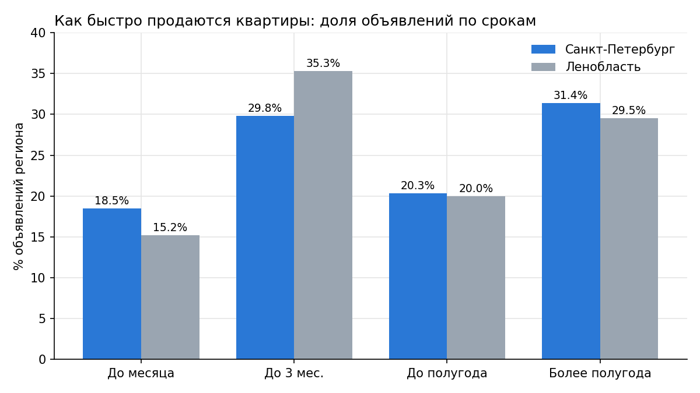
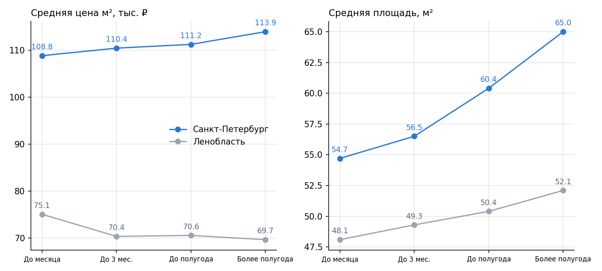
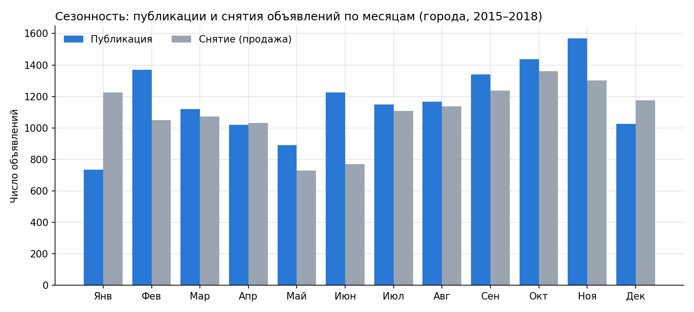
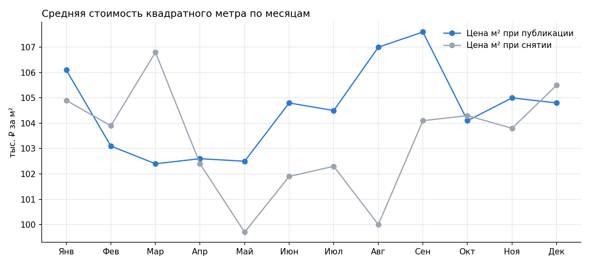
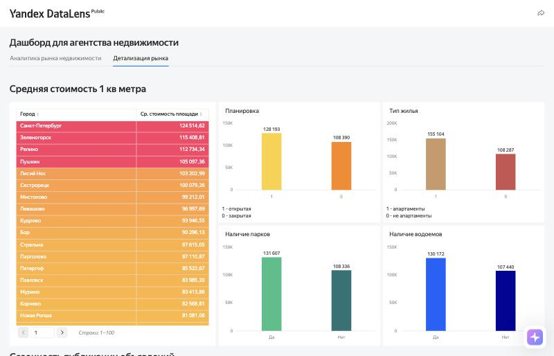
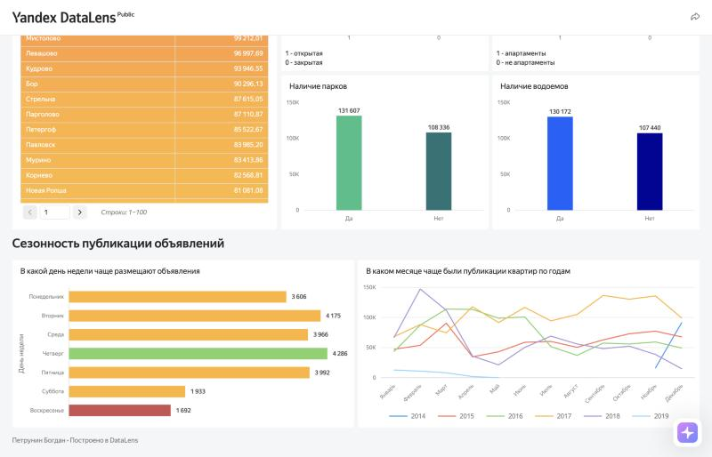

# Анализ рынка недвижимости Санкт-Петербурга и Ленинградской области (SQL + DataLens)

Учебный проект аналитика данных. Агентство недвижимости из Петрозаводска выходит на рынок Санкт-Петербурга и Ленинградской области. По данным объявлений о продаже квартир нужно понять, какие квартиры продаются быстрее, в какие месяцы рынок активнее и от чего зависит цена, и собрать дашборд для руководства.

**Дашборд:** [открыть в Yandex DataLens](https://datalens.yandex/n1o1xdd5k4ku7?_share_link=public) (публичный доступ)

**Инструменты:** SQL (PostgreSQL, DBeaver): CTE, JOIN, оконные функции, `PERCENTILE_CONT` / `PERCENTILE_DISC`, `CASE`, `EXTRACT`; Yandex DataLens.


---

## Данные

Схема `real_estate`, таблицы:

| Таблица | Что содержит |
|---|---|
| `flats` | Характеристики квартиры: площадь, комнаты, балконы, высота потолков, этаж и этажность, тип и город |
| `advertisement` | Объявление: дата публикации, срок размещения в днях (`days_exposition`), последняя цена |
| `city` | Справочник населённых пунктов |
| `type` | Справочник типов населённых пунктов |

Период анализа: **2015–2018 годы**, только полные годы.

## Что сделано

**1. Очистка выбросов.** Границы считаются по перцентилям: сверху 99-й перцентиль для площади, комнат, балконов и высоты потолков, снизу 1-й перцентиль высоты потолков. Пропуски не удаляются, чтобы не терять объявления.

**2. Задача 1: время активности объявлений.** Объявления делятся по сроку размещения на четыре группы: до месяца, до трёх месяцев, до полугода, более полугода. Для каждой группы отдельно по Санкт-Петербургу и Ленинградской области посчитаны средняя цена квадратного метра, средняя площадь, медианы комнат, балконов и этажности, число объявлений и доля.

**3. Задача 2: сезонность.** По месяцам публикации и месяцам снятия объявления посчитаны число объявлений, средняя цена квадратного метра и средняя площадь (только города).

**4. Дашборд** в DataLens из двух вкладок: «Аналитика рынка недвижимости» (KPI, динамика, топ-5 населённых пунктов) и «Детализация рынка» (цена по городам, влияние планировки, типа жилья, парков и водоёмов, сезонность публикаций).

Скрипт: [`Анализ недвижимости.sql`](%D0%90%D0%BD%D0%B0%D0%BB%D0%B8%D0%B7%20%D0%BD%D0%B5%D0%B4%D0%B2%D0%B8%D0%B6%D0%B8%D0%BC%D0%BE%D1%81%D1%82%D0%B8.sql)

---

## Результаты

### Задача 1. Как быстро продаются квартиры

Проанализировано **14 489 объявлений**: 9 609 в Санкт-Петербурге и 4 880 в Ленинградской области.



| Регион | Срок | Объявлений | Цена м², ₽ | Площадь, м² | Медиана этажности |
|---|---|---|---|---|---|
| Санкт-Петербург | До месяца | 1 777 | 108 843 | 54,7 | 10 |
| Санкт-Петербург | До 3 месяцев | 2 860 | 110 419 | 56,5 | 12 |
| Санкт-Петербург | До полугода | 1 952 | 111 179 | 60,4 | 10 |
| Санкт-Петербург | Более полугода | 3 020 | 113 906 | 65,0 | 10 |
| Ленобласть | До месяца | 741 | 75 129 | 48,1 | 10 |
| Ленобласть | До 3 месяцев | 1 722 | 70 369 | 49,3 | 9 |
| Ленобласть | До полугода | 977 | 70 595 | 50,4 | 8 |
| Ленобласть | Более полугода | 1 440 | 69 660 | 52,1 | 6 |

Медиана комнат почти везде равна 2 (только у быстро продающихся квартир в Ленобласти 1), медиана балконов равна 1.



### Задача 2. Сезонность

Проанализировано **14 045 объявлений** в городах.





| Месяц | Публикаций | Цена м² при публикации, ₽ | Площадь, м² | Снятий | Цена м² при снятии, ₽ |
|---|---|---|---|---|---|
| Январь | 735 | 106 106 | 59,2 | 1 225 | 104 947 |
| Февраль | 1 369 | 103 059 | 60,1 | 1 048 | 103 884 |
| Март | 1 119 | 102 430 | 60,0 | 1 071 | 106 832 |
| Апрель | 1 021 | 102 632 | 60,6 | 1 031 | 102 444 |
| Май | 891 | 102 465 | 59,2 | 729 | 99 724 |
| Июнь | 1 224 | 104 802 | 58,4 | 771 | 101 864 |
| Июль | 1 149 | 104 489 | 60,4 | 1 108 | 102 291 |
| Август | 1 166 | 107 035 | 59,0 | 1 137 | 100 037 |
| Сентябрь | 1 341 | 107 563 | 61,0 | 1 238 | 104 070 |
| Октябрь | 1 437 | 104 065 | 59,4 | 1 360 | 104 317 |
| Ноябрь | 1 569 | 105 049 | 59,6 | 1 301 | 103 791 |
| Декабрь | 1 024 | 104 775 | 58,8 | 1 175 | 105 505 |

---

## Выводы

**Санкт-Петербург и область — два разных рынка.** Цена квадратного метра в Петербурге около 109–114 тыс. ₽, в области 70–75 тыс. ₽: разница в 1,5 раза. Петербург составляет две трети выборки (9 609 из 14 489 объявлений).

**Скорость продажи.** В Петербурге за месяц продаётся 18,5% объявлений, в области 15,2%. Основная масса продаётся за 1–3 месяца: 30% в Петербурге и 35% в области. Дольше полугода объявление висит у 31% петербургских и 30% областных квартир, то есть почти каждая третья.

**Что продаётся быстрее.** Чем больше площадь, тем дольше продаётся квартира. В Петербурге средняя площадь растёт с 54,7 м² (до месяца) до 65,0 м² (более полугода), в области с 48,1 до 52,1 м². В Петербурге долго продаются и более дорогие квартиры (108,8 → 113,9 тыс. ₽ за м²). В области наоборот: быстрее всего уходят квартиры с самой высокой ценой квадрата (75,1 тыс. ₽ у продающихся за месяц против 69,7 тыс. ₽ у висящих дольше полугода), а этажность у долго продающихся ниже (медиана 6 этажей против 10). Возможно, быстро продаются квартиры в более крупных и обустроенных населённых пунктах области.

**Сезонность публикаций.** Больше всего объявлений появляется осенью и в феврале: ноябрь (1 569), октябрь (1 437), февраль (1 369) и сентябрь (1 341). Самые слабые месяцы: январь (735), май (891), декабрь (1 024) и апрель (1 021).

**Сезонность снятий.** Чаще всего объявления снимают в январе (1 225), октябре (1 360) и ноябре (1 301), реже всего в мае (729) и июне (771). Пики публикаций и снятий в целом совпадают: активный сезон это сентябрь–ноябрь.

**Цена и площадь по месяцам.** Цена квадратного метра в объявлениях выше всего в августе–сентябре (около 107 тыс. ₽) и январе (106 тыс. ₽), ниже всего весной, с марта по май (около 102,5 тыс. ₽). Разброс небольшой (около 5%), поэтому сезонность цены слабая. Средняя площадь почти не меняется (58–61 м²).

**Влияние характеристик на цену (дашборд).** Средняя цена квадратного метра выше у квартир с открытой планировкой (128 против 108 тыс. ₽), у апартаментов (155 против 108 тыс. ₽) и у квартир рядом с парками и водоёмами (около 130 против 108 тыс. ₽). Самая высокая цена м² в Санкт-Петербурге (124,5 тыс. ₽), Зеленогорске, Репино и Пушкине.

## Рекомендации агентству

1. **Начинать с Санкт-Петербурга.** Здесь больше объявлений и выше цена квадратного метра, значит выше комиссия с одной сделки. Область имеет смысл добавлять для городов с высокой ценой: Зеленогорск, Пушкин, Сестрорецк, Кудрово, Мурино.
2. **Запускать работу с осени.** Сентябрь–ноябрь самое активное время по публикациям и по продажам, поэтому запуск лучше приурочить к этому периоду. Зимой (январь) и в мае активность минимальна.
3. **Закладывать 1–3 месяца на продажу и работать с «залежавшимися» объектами.** Около трети объявлений висит больше полугода, для них нужны корректировка цены и продвижение.
4. **Брать в работу квартиры с меньшей площадью.** Небольшие квартиры (до 55 м² в Петербурге) продаются быстрее, так что они дадут быстрый оборот на старте.
5. **Учитывать факторы, повышающие цену:** открытая планировка, апартаменты, парки и водоёмы рядом можно использовать как аргумент в оценке объекта.

## Ограничения

- Сезонность рассчитана по месяцам за 2015–2018 годы без разбивки по годам, поэтому различия между годами (например, рост рынка) здесь не видны.
- Месяц снятия объявления считается как дата публикации плюс срок размещения. Объявления, которые ещё не сняты (`days_exposition` пустой), в задаче 2 попадают в отдельную строку с пустым месяцем: таких 851 объявление, у них самая высокая средняя цена (121 тыс. ₽) и площадь (77 м²). В таблице результатов выше они не показаны.
- В задаче 1 учтены только снятые объявления, а в задаче 2 только города, поэтому объёмы выборок (14 489 и 14 045) не совпадают.
- Граница 180 дней в запросе попадает сразу в две категории, но условия проверяются по порядку, и день относится к «До полугода».
- На дашборде график «В каком месяце чаще были публикации квартир по годам» показывает значения в десятках тысяч, а не число объявлений (всего в базе 23 650 квартир). Пользоваться для выводов о сезонности стоит таблицей и графиками выше, а также диаграммой по дням недели.
- «Топ-5» на дашборде по дням продажи и по средней цене включает населённые пункты с малым числом объявлений.





## Структура репозитория

```
├── README.md
├── Анализ недвижимости.sql    # запросы для задач 1 и 2
└── images/                    # скриншоты дашборда и графики
```
