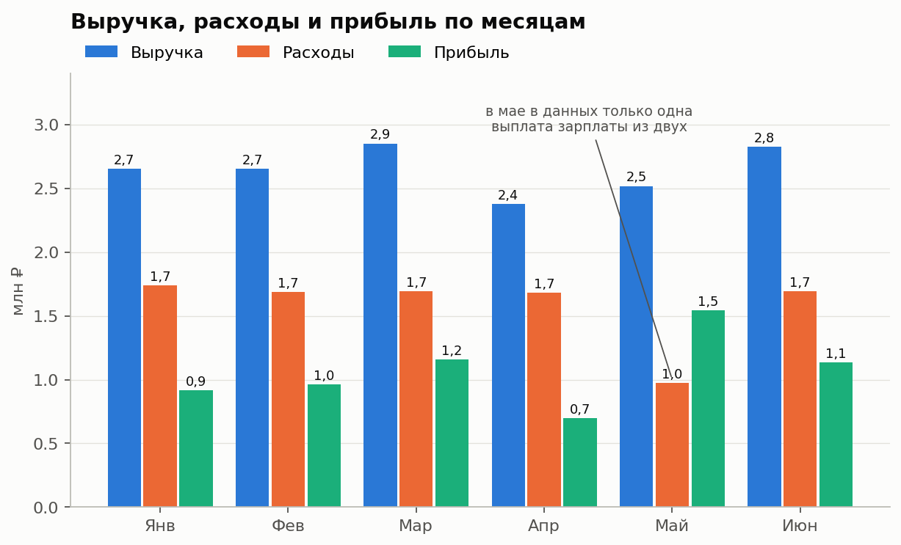
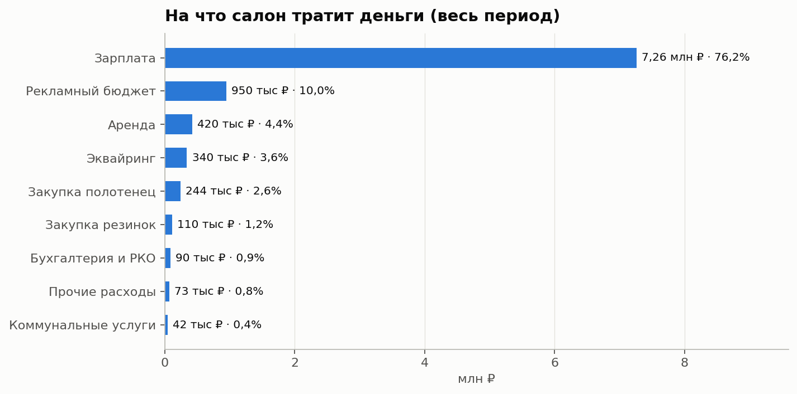
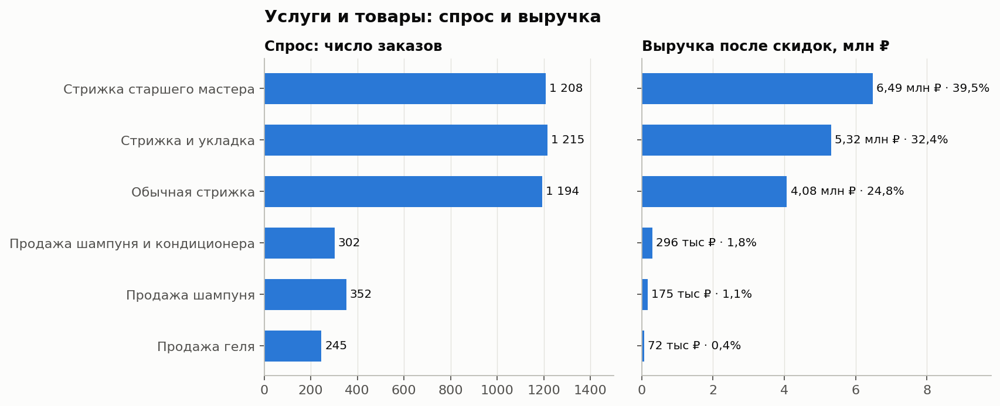
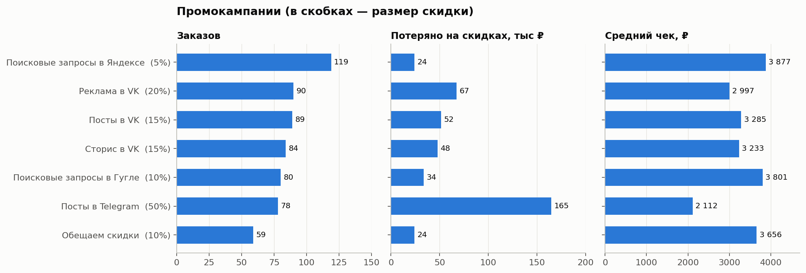

# Салон Waves: анализ доходов, расходов и промоакций

Учебный проект аналитика данных: разбор финансов салона для кудрявых за полгода в Google Таблицах. Цель — найти точки роста прибыли: понять, окупаются ли промоакции и какие услуги и товары приносят основную выручку.

**Таблица с анализом:** [открыть в Google Таблицах](https://docs.google.com/spreadsheets/d/1DoSJd_O-VVXjGSUusbpANB1lrs3q3UjLYhGb9ZKaIqs/edit?usp=sharing) (доступ на просмотр)

**Инструменты:** Google Таблицы (формулы, сводные таблицы, диаграммы).

---

## Бизнес-контекст

Салон Waves работает на рынке полгода и ведёт отчётность вручную в Google Таблицах. Владельцы хотят увеличить прибыль и попросили проанализировать:

1. **Промоакции:** сколько салон на них тратит, какие промокампании привлекают больше клиентов, сколько выручки теряется из-за скидок и какой средний чек у каждой кампании.
2. **Ассортимент:** какие товары и услуги пользуются наибольшим спросом и приносят больше выручки.

## Данные

Выгрузка учётной таблицы салона: **5 356 операций** с 1 января по 7 июля 2024 года (июль неполный, в сравнении месяцев не участвует).

| Поле | Описание |
|---|---|
| Операция | Доход (4 516 записей) или расход (840) |
| Вид, Категория | Услуга или товар и конкретная позиция: 3 вида стрижек, 3 товара, 9 статей расходов |
| Тип | Наличные или безнал |
| Дата и время заказа, Месяц заказа | Дата операции и номер месяца |
| Промокод, ID и название промокампании, Процент скидки | Данные по промоакции, если она была применена |
| Сумма скидки, Стандартная стоимость, Итоговая стоимость | Деньги: цена по прайсу, скидка и сумма к оплате |

## Структура таблицы

| Лист | Что внутри |
|---|---|
| `Export` | Исходная выгрузка |
| `promocodes` | Справочник: промокод, ID и название кампании, размер скидки |
| `Отчёт о выручке и расходах` | Доходы, расходы и детализация по месяцам, диаграмма |
| `Отчёт о популярности товаров и услуг и выручке от них` | Спрос (число заказов) и выручка по каждой позиции по месяцам, прибыль по товарам |
| `Отчёт о рентабельности промокампаний` | Число применённых промокодов, недополученная выручка и средний чек по кампаниям, диаграммы |

## Ключевые выводы

### Финансы
- За полные месяцы (январь–июнь) выручка составила **15,88 млн ₽**, расходы — **9,46 млн ₽**, прибыль — **6,42 млн ₽ (маржа 40,4%)**.
- Выручка стабильна: от 2,4 до 2,9 млн ₽ в месяц, средний чек почти не меняется (около 3 640 ₽). Самый слабый месяц — апрель (2,38 млн ₽, 655 заказов), самый сильный — март (2,85 млн ₽).
- В мае в данных всего одна выплата зарплаты (660 тыс. ₽) вместо двух, как в остальные месяцы. Из-за этого расходы мая занижены, а прибыль выглядит рекордной (маржа 61%). Если добавить недостающие 660 тыс. ₽ (допущение), прибыль за полгода — около **5,76 млн ₽, маржа 36,2%**.



### Расходы
- **Зарплата — 76% всех расходов** (7,26 млн ₽) и 44% выручки. Остальные статьи по сравнению с ней невелики.
- Рекламный бюджет — **950 тыс. ₽ (10% расходов)**, дальше аренда (4,4%) и эквайринг (3,6%).



### Услуги и товары
- **Услуги дают 96,7% выручки**, товары — только 3,3% (543 тыс. ₽).
- Спрос на три вида стрижек почти одинаков (около 1 200 заказов каждой), поэтому разницу в выручке создаёт цена: **стрижка старшего мастера — 39,5% выручки** (6,49 млн ₽, средний чек 5 373 ₽), стрижка с укладкой — 32,4%, обычная стрижка — 24,8%.
- Товаров продаётся примерно **1 на 4 услуги**. Валовая прибыль по товарам при себестоимости из условия задачи (500 / 250 / 150 ₽ за единицу) — около 268 тыс. ₽ (маржа примерно 49%), то есть товары прибыльны, но их слишком мало.



### Промоакции
- Промокоды применены в **599 заказах (13% всех заказов, 12% выручки)**. На скидках салон **недополучил 413,7 тыс. ₽** — 17% от стоимости заказов по промо.
- **Размер скидки не связан с числом клиентов.** Поиск в Яндексе со скидкой 5% привёл больше всех заказов (119), а Telegram со скидкой 50% — всего 78, столько же, сколько Google со скидкой 10% (80).
- **Telegram (скидка 50%) — самая дорогая кампания:** 164,7 тыс. ₽ потерянной выручки, это **40% всех скидок**. Средний чек — 2 112 ₽ против 3 800–3 900 ₽ у поисковой рекламы.
- **Лучшие кампании — поисковые запросы в Яндексе и Google:** больше всего заказов, небольшая скидка (204–422 ₽ на заказ) и самый высокий средний чек (3 877 ₽ и 3 801 ₽).
- Клиенты с промокодом платят меньше: средний чек услуги 3 734 ₽ против 4 502 ₽ без промокода.
- Грубая оценка окупаемости: рекламный бюджет 950 тыс. ₽ и промо-заказы на 1,98 млн ₽ — около 2,1 ₽ выручки на 1 ₽ бюджета. Это выручка, а не прибыль, и бюджет в данных не разбит по кампаниям, поэтому окупаемость каждого канала отдельно посчитать нельзя.



| Кампания | Скидка | Заказов | Потеряно на скидках, ₽ | Средний чек, ₽ |
|---|---|---|---|---|
| Поисковые запросы в Яндексе | 5% | 119 | 24 280 | 3 877 |
| Реклама в VK | 20% | 90 | 67 440 | 2 997 |
| Посты в VK | 15% | 89 | 51 600 | 3 285 |
| Сторис в VK | 15% | 84 | 47 925 | 3 233 |
| Поисковые запросы в Гугле | 10% | 80 | 33 790 | 3 801 |
| Посты в Telegram | 50% | 78 | 164 700 | 2 112 |
| Обещаем скидки | 10% | 59 | 23 970 | 3 656 |
| **Итого** | | **599** | **413 705** | **3 305** |

## Рекомендации

1. **Пересмотреть скидку 50% в Telegram.** Она даёт столько же заказов, сколько скидки 10%. Если снизить её до 10–15% и объём заказов сохранится, салон сэкономит примерно 115–130 тыс. ₽ за полгода (сохранение объёма стоит проверить тестом).
2. **Увеличить долю поискового трафика (Яндекс, Google):** там самый высокий средний чек и самая дешёвая скидка на заказ.
3. **Проверить скидку 20% в рекламе VK.** 749 ₽ скидки на заказ при среднем чеке 2 997 ₽ — попробовать 10% и сравнить число заказов.
4. **Вести рекламный бюджет по кампаниям.** Без этого окупаемость каналов не посчитать.
5. **Сделать промокоды одноразовыми.** Сейчас 114 кодов использовано 599 раз (до 8 раз каждый), неясно, сколько это уникальных клиентов.
6. **Работать с ценой и загрузкой мастеров.** Спрос на три вида стрижек одинаков, а старший мастер приносит почти 40% выручки: проверить его загрузку и возможность поднять цену на остальные стрижки.
7. **Развивать допродажи товаров.** Маржа товаров около 49%, но продаётся 1 товар на 4 услуги: предлагать набор «шампунь + кондиционер» при записи. Рычаг небольшой по масштабу.
8. **Контролировать расходы на зарплату** (44% выручки): самая крупная и самая перспективная статья для оптимизации.

## Качество данных и ограничения

- Данные вносятся вручную разными людьми, поэтому в мае пропущена выплата зарплаты (см. выше), а заказ №5352 содержит промокод без кампании и скидки (учтён как заказ без промо).
- Период — полгода и неделя: сезонность оценить нельзя.
- Выручка по промокоду не равна выручке, которую принесла реклама: часть клиентов могла прийти и без неё.
- Данные не связывают товар и услугу в одном визите, поэтому «1 товар на 4 услуги» — оценка по числу операций.

## Структура репозитория

```
├── README.md
├── data/
│   └── Салон Waves.csv    # исходная выгрузка (лист Export)
└── images/                # графики для README
```
